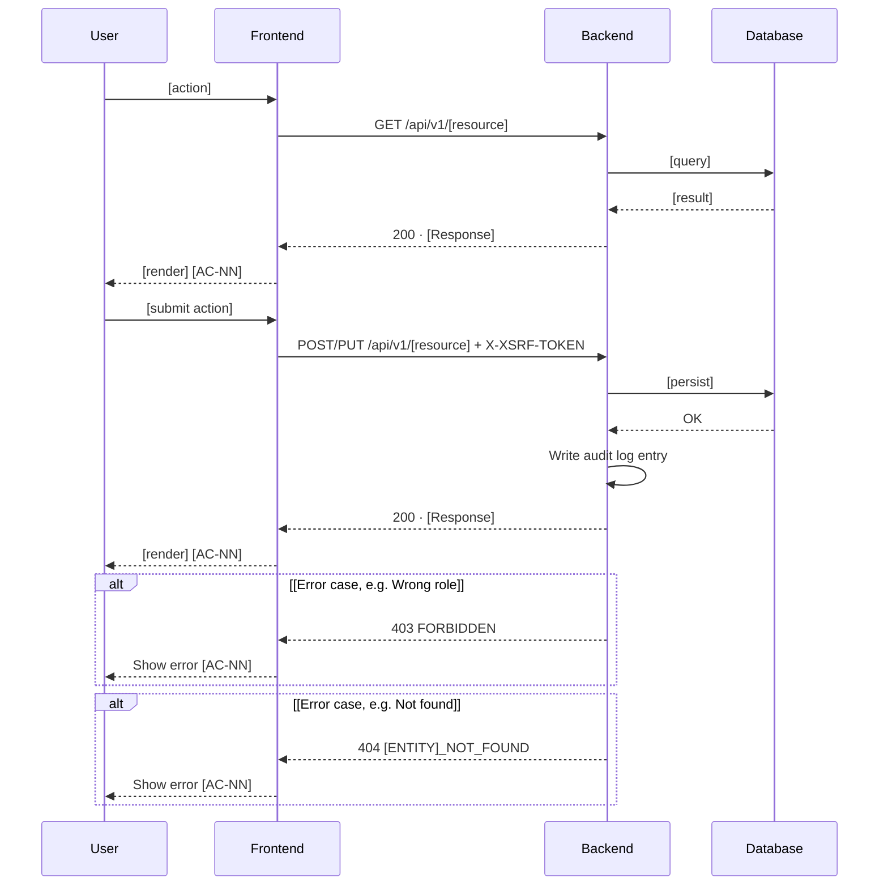

# Plan: [Feature Name] ([CODE])

> **Feature:** 7.x [Feature Name]
> **Spec:** [spec.md](spec.md)
> **SDS §5.x:** [SDS.md §5.x](../../SDS.md#5x-feature-name-code)

---

## [CODE]-US-NN: [Story Title]

### Pre-flight: Spec Review Findings

Reviewed `spec.md` and existing implementation before design. The following gaps and ambiguities were identified.

| ID | Type | AC | Finding | Resolution |
|----|------|----|---------|------------|
| G1 | **Gap** | AC-NN | [description of gap] | [how it's resolved — a decision below, or "Open task T1 — what to do"] |
| A1 | Ambiguity | AC-NN | [ambiguity description] | [resolution decision, with the reasoning if not obvious] |

> Repeat this section per user story if the feature's stories were reviewed separately. Every AC-referencing gap or ambiguity found during design belongs here — do not resolve it silently in the Architecture section below.

*Pre-flight Gaps checklist*
- [ ] Zero spec gaps flagged — or flagged gaps were resolved before this `plan.md` was reviewed
- [ ] If significant gaps or ambiguity remain after review, the work goes back to the Spec step rather than being patched forward here
- [ ] Design scope matches the US being designed — no scope creep into unrelated stories

---

### Architecture

**Package layout**

List only files that are new or modified for this story. Annotate each with `# new:` or `# modify:` plus a one-line purpose — enough that a reviewer doesn't need to open the file to know why it exists. Wrap onto a `#` continuation line when one line isn't enough; do not let inline comments overflow without wrapping.

```text
backend/src/main/java/com/globee/grm/
├── controller/
│   └── [Entity]Controller.java          # new: [HTTP method + path] — [what it does, what it delegates to]
├── service/
│   └── [Entity]Service.java             # new: [business rules owned, key delegations]
├── exception/
│   └── [entity]/
│       └── [Entity]NotFoundException.java  # new: → [HTTP code] [ERROR_CODE]
├── repository/
│   └── [Entity]Repository.java          # new: [key query methods]
├── model/
│   └── [Entity].java                    # new: @Entity → [table_name]
└── dto/
    ├── [Entity]Request.java             # new: [fields]
    └── [Entity]Response.java            # new: [fields]

backend/src/main/resources/db/migration/
└── V[N]__[description].sql              # new/modify: [tables/columns added]

frontend/
├── app/[feature]/
│   ├── page.tsx                         # new: [what it renders]
│   └── _components/
│       └── [Component].tsx              # new: [what it does]
├── services/
│   └── [entity]Service.ts               # new: [API calls it wraps]
└── store/
    └── slices/[entity]Slice.ts          # new: [state shape, thunks] — only if Redux state is needed
```

*Technical Design checklist* (self-check against [aif-review-checklist.md](../../aif-review-checklist.md#step-2--design-step--se-reviews))
- [ ] Business logic is assigned to the **service layer** (AR-01); controllers are thin (AR-02); repositories are data-access only (AR-03)
- [ ] DTO mapping is handled by mapper classes or service methods — not controllers or repositories (AR-04)
- [ ] Multi-entity write operations are wrapped in a single `@Transactional` method (AR-05)
- [ ] Sequence diagrams follow the correct call chain: Controller → Service → Repository (AR-01–AR-03)
- [ ] Service layer never touches Controller-related objects like HttpRequest, HttpResponse... — that belongs to the controller (AR-01/AR-02)

**Domain objects**

| Domain Object | Database Entity | Key Fields | Notes |
|--------|-------|------------|-------|
| `[Entity]` | `[table_name]` | `id` (PK), [field1, field2] | [uniqueness, nullability, or lifecycle notes worth calling out] |

*Data Modeling checklist*
- [ ] Domain Entities (in CDM, SRS §2) are kept distinct from Domain Objects (in memory, `plan.md`) — no premature technical binding
- [ ] A separate model/entity for a Many-to-Many relationship is introduced **only** when the join table carries extra attributes (e.g. `enrolled_at`, `quantity`); otherwise a plain join table is used
- [ ] `GenerationType` (`AUTO` / `UUID` / `IDENTITY`) is chosen deliberately per entity, not defaulted blindly
- [ ] Eager vs Lazy loading is chosen per relationship with the tradeoff stated (N+1 select problem risk vs over-fetching)
- [ ] Employee vs User relationship is respected: `User` is composite with `Employee` (`User` = auth/login info, `Employee` = business info) — not merged or reversed
- [ ] Business Unit is scoped correctly: created when a new internal unit is needed and may represent a unit in a foreign country

**Business rules enforced in service layer**

| Code | Rule | Source | Enforcement |
|------|------|--------|-------------|
| [CODE]-BR-01 | [rule description] | AC-NN | `[Repository/Service method()]` → [HTTP code] `[ERROR_CODE]` |

> `[CODE]-BR-NN` codes are local to this plan's business-rules table — do not confuse with the numbered `BR-NN` rules in `constitution.md`, which are project-wide and referenced separately in Constitution notes below.

**Sequence diagram — [Action Name]**

Use a Mermaid `sequenceDiagram` (matches the convention already used in `SDS.md`). Show the happy path first, then one `alt` block per error/edge case, each tagged with the AC it satisfies.

*Sequence Diagrams checklist*
- [ ] Arrows follow correct logical order and are numbered for traceability
- [ ] Every action arrow has a matching return arrow
- [ ] Arrow labels describe the action/intent, not a method name or UI click target (e.g. "validate employee code", not "call `validateCode()`" or "click Submit button")
- [ ] Diagram favors earliest possible UI response — the user is not made to wait on DB operations before seeing feedback
- [ ] Feature access goes straight to the relevant page (e.g. "create record" → navigate directly to the creation page) instead of intermediate click-throughs
- [ ] Each workflow is cut off cleanly when it ends — separate flows are not blended into one diagram
- [ ] No direct SQL statements, backend method signatures, or frontend method parameters appear on the diagram — only actor-level actions



*API Design checklist*
- [ ] All endpoints are versioned under `/api/v1/` with kebab-case plural resource names (API-01)
- [ ] Response envelope is present: `{ success, message, data, timestamp }` (API-02)
- [ ] HTTP status codes follow the mapping table (201 for creation, 400 for malformed input, 409 for conflicts, 422 for validation, etc.) (API-03)
- [ ] Error codes use `UPPER_SNAKE_CASE` with a resource prefix — e.g. `PROJECT_NOT_FOUND`, `CONFLICT_PENDING_REQUEST` — and are listed in the SDS error catalog (API-04)
- [ ] No generic `updateStatus` endpoint — each business action that triggers a state transition has its own explicit endpoint (API-05)
- [ ] List endpoints include `page`/`pageSize` parameters; max 1000 (API-06)

*Naming & Security checklist*
- [ ] Package names follow `com.globee.grm.<feature>` (NC-01)
- [ ] Entity, Request/Response DTO, and DB table names follow NC-02–NC-04
- [ ] Method names are concise within their service context (e.g. within `BusinessUnitService`, `create` not `createBusinessUnit`) — qualified only when disambiguating a different operation
- [ ] Enum values match the SRS state machine definitions and serialize as human-readable string labels in API responses — e.g. `"status": "InProgress"` in JSON, "In Progress" in UI (NC-05)
- [ ] Each endpoint's permitted roles match the permission matrix in SRS/SDS (AC-01)
- [ ] Role authorization (`@PreAuthorize` or service-level check) is specified on every protected endpoint (AC-02)
- [ ] CSRF validation is specified for all POST/PUT/PATCH/DELETE endpoints (AC-05)
- [ ] Any new public API route (no auth required) is explicitly justified — not silently added to the SecurityConfig allowlist (Tech-IV)
- [ ] Spring Security Filter Chain order is correctly reflected in the design: Web Filter → Security Filter Chain → `authorizeHttpRequests` → Controller
- [ ] Passwords are designed to be hashed before storage — never stored or compared as plain text
- [ ] Bookmark/direct-URL access is validated at the filter layer in addition to route guarding (double validation)

**Error flows**

List the scenarios that apply to this story's endpoint(s).

| Scenario | HTTP | Error Code |
|----------|------|------------|
| [scenario] | [code] | `[ERROR_CODE]` |

**Constitution notes**

List the constitution rules relevant to this story's design.

| Rule | Status | Note |
|------|--------|------|
| [rule] | Satisfied / Required / Note | [why] |
| [other applicable rule] | Satisfied / Required / Note | [why] |

*Cross-Document Sync checklist*
- [ ] If a new Domain Entity is introduced: SDS §2.1 traceability table is updated in the same edit (Cross-Doc)
- [ ] SRS §2 ↔ SDS §2.1 sync dates are current (Cross-Doc)
- [ ] Every entity name in this `plan.md` matches the SRS §2 domain language exactly — no synonyms (Cross-Doc)

**Element IDs**

| Element | ID | Status | File |
|---------|----|--------|------|
| [button/input/message] | `[btn-action-entity]` | Done / **Missing** | `[component.tsx:line]` |

**Open tasks**

Number tasks `T1, T2, ...` in implementation order (backend model → repository → service → controller → frontend). Use a lettered suffix (`T4b`, `T4c`) to insert a task discovered mid-planning without renumbering everything after it. Each row must name the concrete file(s) touched — a task without a file path is not planning-complete.

| ID | Task | File |
|----|------|------|
| T1 | [what to implement, including key delegations/collaborators] | `[path/to/File.java]` |
| T2 | [what to implement] | `[path/to/file.tsx]` |
