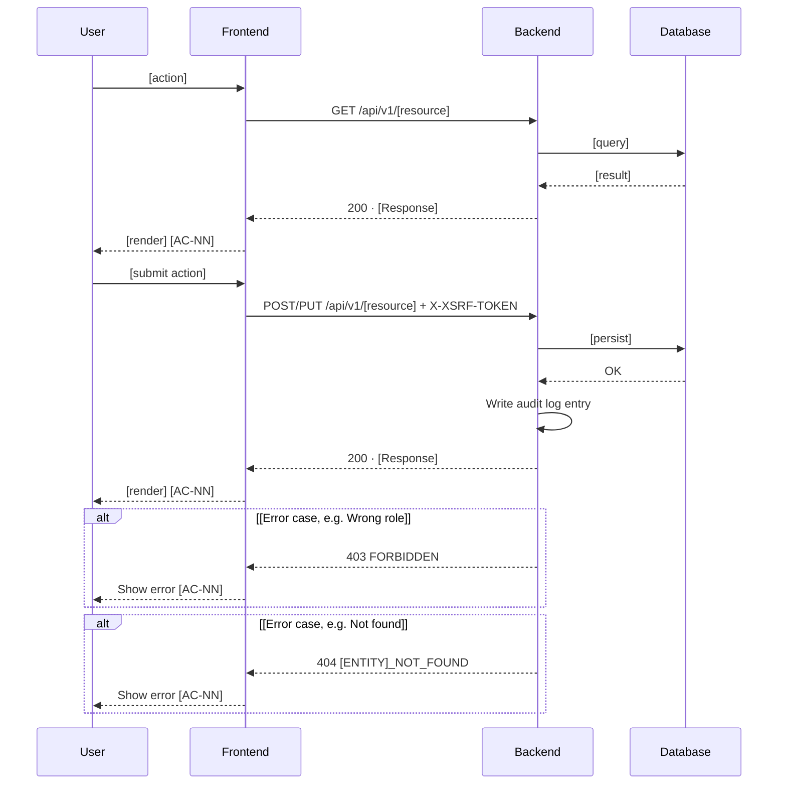

# Plan: [Feature Name] ([CODE])

> **Feature:** 7.x [Feature Name]
> **Spec:** [spec.md](spec.md)
> **SDS §5.x:** [SDS.md §5.x](../../SDS.md#5x-feature-name-code)

**Note**: This file is generated and extended by the `/speckit.plan` command — one `## [CODE]-US-NN` section
per user story, appended in the order stories are designed. See `.claude/skills/speckit-plan/SKILL.md` for the
execution workflow. When `plan.md` already exists for this feature, **append** the new US section below the
existing ones — never delete, rewrite, or renumber a previously completed US section.

---

## [CODE]-US-NN: [Story Title]

### Pre-flight: Spec Review Findings

Reviewed `spec.md` and existing implementation before design. The following gaps and ambiguities were identified.

| ID | Type | AC | Finding | Resolution |
|----|------|----|---------|------------|
| G1 | **Gap** | AC-NN | [description of gap] | [how it's resolved — a decision below, or "Open task T1 — what to do"] |
| A1 | Ambiguity | AC-NN | [ambiguity description] | [resolution decision, with the reasoning if not obvious] |

> Repeat this section per user story if the feature's stories were reviewed separately. Every AC-referencing gap or ambiguity found during design belongs here — do not resolve it silently in the Architecture section below. If no gaps or ambiguities were found, state that explicitly rather than deleting the section.

*Pre-flight Gaps checklist*
- [ ] Zero spec gaps flagged — or flagged gaps were resolved before this `plan.md` was reviewed
- [ ] If significant gaps or ambiguity remain after review, the work goes back to the Spec step rather than being patched forward here
- [ ] Design scope matches the US being designed — no scope creep into unrelated stories

---

### Architecture

**Package layout**

List only files that are new or modified for this story. Annotate each with `# new:` or `# modify:` plus a one-line purpose — enough that a reviewer doesn't need to open the file to know why it exists. Wrap onto a `#` continuation line when one line isn't enough; do not let inline comments overflow without wrapping.

```text
backend/app/
├── api/
│   └── admin_routes.py                  # modify: [HTTP method + path] — [what it does, what it delegates to]
├── services/
│   └── [entity]_service.py              # new: [business rules owned, key delegations]
├── models/
│   ├── domain/
│   │   └── [entity].py                  # new: read model + Create/Update value objects
│   └── entities/
│       └── [entity]_row.py              # new: SQLAlchemy ORM row → [table_name]
├── models/
│   ├── exceptions.py                    # modify: [Entity]NotFoundError → [HTTP code] [ERROR_CODE]
│   └── dtos.py                          # modify: [Entity]Request/[Entity]Response
├── repositories/
│   └── [entity]_repository.py           # new: [key query methods]
└── dependencies.py                      # modify: get_[entity]_repo(), get_[entity]_service()

backend/tests/
└── test_[entity].py                     # new: integration tests through the HTTP layer

frontend/admin/src/
├── pages/[feature]/
│   └── [Page].tsx                       # new: [what it renders]
└── api/
    └── client.ts                        # modify: [API calls added]
```

*Technical Design checklist* (self-check against [Layer Architecture](../../CLAUDE.md#layer-architecture) in `CLAUDE.md`/`constitution.md`)
- [ ] Business logic is assigned to the **service layer**; routes are thin (map DTO ↔ domain object, catch domain exceptions → `HTTPException`); repositories are data-access only
- [ ] Services accept/return domain value objects and read models only — **never DTOs** (DTOs live at the HTTP boundary only, per `dtos.py`)
- [ ] Repository mapping boundary is respected: read → ORM row → `model_validate()` → domain model; write → value object (`CreateX`/`UpdateX`) → ORM row
- [ ] Multi-entity write operations are wrapped in a single repository/service transaction
- [ ] Sequence diagrams follow the correct call chain: Route → Service → Repository (or Route → Service → Agent → Core → Provider for BusinessOutcome-pipeline work)
- [ ] Service layer never touches route-level objects (`Request`/`HTTPException` construction) — that belongs to the route
- [ ] New Postgres table → **Repository** (`AsyncSession`); external system/infra client → **Provider** singleton — never the reverse

**Domain objects**

| Domain Object | Database Entity | Key Fields | Notes |
|--------|-------|------------|-------|
| `[Entity]` | `[table_name]` | `id` (PK), [field1, field2] | [uniqueness, nullability, or lifecycle notes worth calling out] |

*Data Modeling checklist*
- [ ] Domain Entities (SRS §2 CDM) are kept distinct from Domain Objects (`backend/app/models/domain/`) — no premature technical binding
- [ ] Read models and write value objects (`CreateX`/`UpdateX`) are placed in the correct file per the `backend/app/models/domain/` layout table in `CLAUDE.md`
- [ ] A separate model/table for a Many-to-Many relationship is introduced **only** when the join table carries extra attributes; otherwise a plain join table is used
- [ ] Business rules touching discount caps, frequency caps, scarcity thresholds, or plan min score are read from Brand Config (`core/config.py`) — never hardcoded

**Business rules enforced in service layer**

| Code | Rule | Source | Enforcement |
|------|------|--------|-------------|
| [CODE]-BR-01 | [rule description] | AC-NN | `[Repository/Service method()]` → [HTTP code] `[ERROR_CODE]` |

> `[CODE]-BR-NN` codes are local to this plan's business-rules table — do not confuse with the numbered rules in `constitution.md`, which are project-wide and referenced separately in Constitution notes below.

**Sequence diagram — [Action Name]**

Use a Mermaid `sequenceDiagram` (matches the convention already used in `SDS.md`). Show the happy path first, then one `alt` block per error/edge case, each tagged with the AC it satisfies.

*Sequence Diagrams checklist*
- [ ] Arrows follow correct logical order and are numbered for traceability
- [ ] Every action arrow has a matching return arrow
- [ ] Arrow labels describe the action/intent, not a method name or UI click target
- [ ] Diagram favors earliest possible UI response — the user is not made to wait on DB/agent operations before seeing feedback
- [ ] Feature access goes straight to the relevant page instead of intermediate click-throughs
- [ ] Each workflow is cut off cleanly when it ends — separate flows are not blended into one diagram
- [ ] No direct SQL statements, backend method signatures, or frontend method parameters appear on the diagram — only actor-level actions
- [ ] If this story touches the BusinessOutcome pipeline: guardrail evaluation appears at both plan-evaluation time and step-execution time, and HITL steps use `interrupt()` explicitly — never shown as auto-approved



*API Design checklist*
- [ ] All endpoints are versioned under `/api/v1/` with kebab-case plural resource names
- [ ] Response envelope is present: `{ success, message, data, timestamp }`
- [ ] HTTP status codes follow the mapping table (201 for creation, 400 for malformed input, 409 for conflicts, 422 for validation, etc.)
- [ ] Error codes use `UPPER_SNAKE_CASE` with a resource prefix — e.g. `SIGNAL_CONFIG_NOT_FOUND` — and are listed in the SDS error catalog
- [ ] No generic `updateStatus` endpoint — each business action that triggers a state transition has its own explicit endpoint
- [ ] List endpoints include `page`/`pageSize` parameters; max 1000
- [ ] SSE-streamed endpoints (if any) meet the `< 500ms per step event` latency SLA and are not treated as an enhancement

*Naming & Security checklist*
- [ ] Module/package names follow the existing `backend/app/<layer>/` layout — no ad-hoc top-level packages
- [ ] Entity, Request/Response DTO, and DB table names match the domain language in SRS §2 verbatim — no synonyms
- [ ] Method names are concise within their service context (e.g. within `SignalConfigService`, `create` not `createSignalConfig`) — qualified only when disambiguating a different operation
- [ ] Enum values match the SRS state machine definitions and serialize as human-readable string labels in API responses
- [ ] Each endpoint's permitted roles match the permission matrix in SRS/SDS
- [ ] Role authorization is specified on every protected endpoint
- [ ] CSRF validation is specified for all POST/PUT/PATCH/DELETE endpoints
- [ ] Any new public API route (no auth required) is explicitly justified — not silently added to the allowlist
- [ ] No direct Salesforce SCAPI/CRM/SFMC calls from OBMS code — all external data access goes through `core/tools.py → dispatch()` via MCP
- [ ] Passwords/secrets are designed to be hashed/stored via existing provider patterns — never stored or compared as plain text
- [ ] Bookmark/direct-URL access is validated at the route/dependency layer in addition to route guarding (double validation)

**Error flows**

List the scenarios that apply to this story's endpoint(s).

| Scenario | HTTP | Error Code |
|----------|------|------------|
| [scenario] | [code] | `[ERROR_CODE]` |

**Constitution notes**

List the constitution rules relevant to this story's design.

| Rule | Status | Note |
|------|--------|------|
| [rule] | Satisfied / Required / Note | [why] |
| [other applicable rule] | Satisfied / Required / Note | [why] |

*Cross-Document Sync checklist*
- [ ] If a new Domain Entity is introduced: SDS §2.1 traceability table is updated in the same edit
- [ ] SRS §2 ↔ SDS §2.1 sync dates are current
- [ ] Every entity name in this `plan.md` matches the SRS §2 domain language exactly — no synonyms

**Element IDs**

| Element | ID | Status | File |
|---------|----|--------|------|
| [button/input/message] | `[btn-action-entity]` | Done / **Missing** | `[component.tsx:line]` |

**Open tasks**

Number tasks `T1, T2, ...` in implementation order (repository → domain model → service → dependency wiring → route → frontend). Use a lettered suffix (`T4b`, `T4c`) to insert a task discovered mid-planning without renumbering everything after it. Each row must name the concrete file(s) touched — a task without a file path is not planning-complete.

| ID | Task | File |
|----|------|------|
| T1 | [what to implement, including key delegations/collaborators] | `[path/to/file.py]` |
| T2 | [what to implement] | `[path/to/file.tsx]` |

---

<!--
  Repeat the "## [CODE]-US-NN: [Story Title]" block above for each additional user story
  designed in this feature. Do not merge stories into one section, and do not delete a
  prior US section when adding a new one.
-->

## Complexity Tracking

> Fill ONLY if a US design above required a Constitution Check violation (see `constitution.md`
> § "Simplicity Over Premature Scale"). One row per violation. Append new rows as later US
> sections introduce them — never delete a row belonging to a previously completed US.

| Violation | US | Why Needed | Simpler Alternative Rejected Because |
|-----------|----|-----------|-----------------------------------|
| [e.g., new PostgresSaver checkpoint store] | [CODE]-US-NN | [current need] | [why the simpler alternative — e.g. MemorySaver — was insufficient] |
