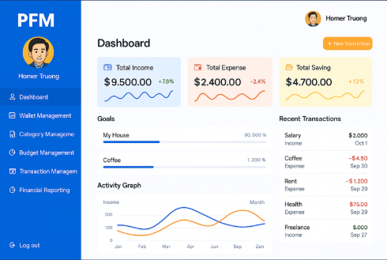
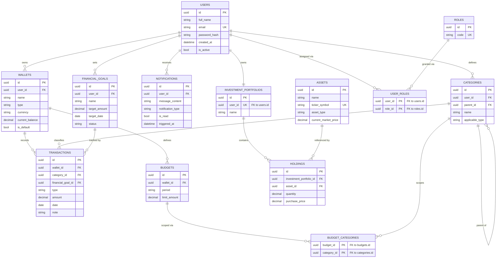

# Personal Finance Management (PFM) - Software Design Specification (SDS)


| Version | Date | Author | Change |
|---------|------|--------|--------|
| 1.0 | 15-Jul-2026 | Homer Truong | Initial draft |
| 1.1 | 19-Jul-2026 | Homer Truong | Reordered System Security/User Management, renamed Features/User Stories to abbreviation IDs (e.g. `SS-US-01`), and filled in §2 Domain Model (attributes, relationships, STDs, `Role` entity), §3 UI Design, and §4.3.3 Database Design |
| 1.2 | 20-Jul-2026 | Homer Truong | Synced with SRS 1.2: added design entries for new/renamed User Stories across UM, WM, TM, FG, IP, NH, DOD; extracted Asset design entries into a new §5.9 Asset Management (AM), actor USER→ADMIN, renumbering IP→§5.10, NH→§5.11, DOD→§5.12; added `User.is_active`, BR-14..18 Data Integrity Rules, and bidirectional Notification STD; expanded §4.2 Logical View to all 12 Features; standardized on `FinancialGoal` (one word) |

---

## Table of Contents

- [1. Introduction](#1-introduction)
  - [1.1 Purpose](#11-purpose)
  - [1.2 Scope](#12-scope)
  - [1.3 Assumptions and Constraints](#13-assumptions-and-constraints)
    - [1.3.1 Assumptions](#131-assumptions)
    - [1.3.2 Constraints](#132-constraints)
  - [1.4 Definitions and Acronyms](#14-definitions-and-acronyms)
  - [1.5 Related Documents](#15-related-documents)
- [2. Technical Domain Model](#2-technical-domain-model)
  - [2.1 Domain Layer Traceability](#21-domain-layer-traceability)
  - [2.2 Domain Object](#22-domain-object)
    - [2.2.1 User](#221-user)
    - [2.2.2 Wallet](#222-wallet)
    - [2.2.3 Category](#223-category)
    - [2.2.4 Budget](#224-budget)
    - [2.2.5 Transaction](#225-transaction)
    - [2.2.6 FinancialGoal](#226-financialgoal)
    - [2.2.7 InvestmentPortfolio](#227-investmentportfolio)
    - [2.2.8 Asset](#228-asset)
    - [2.2.9 Holding](#229-holding)
    - [2.2.10 Notification](#2210-notification)
    - [2.2.11 Role](#2211-role)
  - [2.3 Domain Object Relationships](#23-domain-object-relationships)
  - [2.4 Domain Object State Transition Diagram (STD)](#24-domain-object-state-transition-diagram-std)
- [3. UI Design](#3-ui-design)
  - [3.1 UI / UX Principles](#31-ui--ux-principles)
  - [3.2 Wireframes — UI / UX](#32-wireframes--ui--ux)
- [4. Architecture Design](#4-architecture-design)
  - [4.1 System Context](#41-system-context)
  - [4.2 Logical View](#42-logical-view)
  - [4.3 Development View](#43-development-view)
    - [4.3.1 Frontend Architecture](#431-frontend-architecture)
    - [4.3.2 Backend Architecture (Service Layer)](#432-backend-architecture-service-layer)
    - [4.3.3 Data Design](#433-data-design)
  - [4.4 Process View](#44-process-view)
    - [4.4.1 Sequence Diagrams](#441-sequence-diagrams)
  - [4.5 Physical View](#45-physical-view)
  - [4.6 Key Scenarios](#46-key-scenarios)
  - [4.7 Architecture Principles](#47-architecture-principles)
- [5. Product Features and User Story Specification](#5-product-features-and-user-story-specification)
  - [5.1 System Security (SS)](#51-system-security-ss)
    - [5.1.1 SS-US-01: Login (ADMIN, USER)](#511-ss-us-01-login-admin-user)
    - [5.1.2 SS-US-02: Logout (ADMIN, USER)](#512-ss-us-02-logout-admin-user)
  - [5.2 User Management (UM)](#52-user-management-um)
    - [5.2.1 UM-US-01: Create a User (ADMIN)](#521-um-us-01-create-a-user-admin)
    - [5.2.2 UM-US-02: Update a User Profile (USER)](#522-um-us-02-update-a-user-profile-user)
    - [5.2.3 UM-US-03: View My Profile (USER)](#523-um-us-03-view-my-profile-user)
    - [5.2.4 UM-US-04: List Users (ADMIN)](#524-um-us-04-list-users-admin)
    - [5.2.5 UM-US-05: Deactivate a User (ADMIN)](#525-um-us-05-deactivate-a-user-admin)
    - [5.2.6 UM-US-06: Delete a User (ADMIN)](#526-um-us-06-delete-a-user-admin)
  - [5.3 Wallet Management (WM)](#53-wallet-management-wm)
    - [5.3.1 WM-US-01: Create a Wallet (USER)](#531-wm-us-01-create-a-wallet-user)
    - [5.3.2 WM-US-02: List Wallets (USER)](#532-wm-us-02-list-wallets-user)
    - [5.3.3 WM-US-03: View a Wallet (USER)](#533-wm-us-03-view-a-wallet-user)
    - [5.3.4 WM-US-04: Update a Wallet (USER)](#534-wm-us-04-update-a-wallet-user)
    - [5.3.5 WM-US-05: Set a Wallet as default (USER)](#535-wm-us-05-set-a-wallet-as-default-user)
    - [5.3.6 WM-US-06: Delete a Wallet (USER)](#536-wm-us-06-delete-a-wallet-user)
  - [5.4 Category Management (CM)](#54-category-management-cm)
    - [5.4.1 CM-US-01: Create a Category (USER)](#541-cm-us-01-create-a-category-user)
    - [5.4.2 CM-US-02: List Categories (USER)](#542-cm-us-02-list-categories-user)
    - [5.4.3 CM-US-03: View a Category (USER)](#543-cm-us-03-view-a-category-user)
    - [5.4.4 CM-US-04: Update a Category (USER)](#544-cm-us-04-update-a-category-user)
    - [5.4.5 CM-US-05: Delete a Category (USER)](#545-cm-us-05-delete-a-category-user)
  - [5.5 Budget Management (BM)](#55-budget-management-bm)
    - [5.5.1 BM-US-01: Create a Budget for a Wallet (USER)](#551-bm-us-01-create-a-budget-for-a-wallet-user)
    - [5.5.2 BM-US-02: List Budgets (USER)](#552-bm-us-02-list-budgets-user)
    - [5.5.3 BM-US-03: View a Budget (USER)](#553-bm-us-03-view-a-budget-user)
    - [5.5.4 BM-US-04: Update a Budget (USER)](#554-bm-us-04-update-a-budget-user)
    - [5.5.5 BM-US-05: Delete a Budget (USER)](#555-bm-us-05-delete-a-budget-user)
  - [5.6 Transaction Management (TM)](#56-transaction-management-tm)
    - [5.6.1 TM-US-01: Create a Transaction for a Wallet (USER)](#561-tm-us-01-create-a-transaction-for-a-wallet-user)
    - [5.6.2 TM-US-02: List Transactions (USER)](#562-tm-us-02-list-transactions-user)
    - [5.6.3 TM-US-03: View a Transaction (USER)](#563-tm-us-03-view-a-transaction-user)
    - [5.6.4 TM-US-04: Update a Transaction (USER)](#564-tm-us-04-update-a-transaction-user)
    - [5.6.5 TM-US-05: Delete a Transaction (USER)](#565-tm-us-05-delete-a-transaction-user)
    - [5.6.6 TM-US-06: Filter Transactions by Wallet, Category, Type, or Date Range (USER)](#566-tm-us-06-filter-transactions-by-wallet-category-type-or-date-range-user)
  - [5.7 Financial Reporting (RPT)](#57-financial-reporting-rpt)
    - [5.7.1 RPT-US-01: View the Summary Report (USER)](#571-rpt-us-01-view-the-summary-report-user)
    - [5.7.2 RPT-US-02: View Income Report (USER)](#572-rpt-us-02-view-income-report-user)
    - [5.7.3 RPT-US-03: View Expense Report (USER)](#573-rpt-us-03-view-expense-report-user)
    - [5.7.4 RPT-US-04: Filter Reports by Date (USER)](#574-rpt-us-04-filter-reports-by-date-user)
    - [5.7.5 RPT-US-05: Filter Reports by Wallet or Category (USER)](#575-rpt-us-05-filter-reports-by-wallet-or-category-user)
  - [5.8 FinancialGoal (FG)](#58-financialgoal-fg)
    - [5.8.1 FG-US-01: Create a FinancialGoal (USER)](#581-fg-us-01-create-a-financialgoal-user)
    - [5.8.2 FG-US-02: List FinancialGoals (USER)](#582-fg-us-02-list-financialgoals-user)
    - [5.8.3 FG-US-03: View a FinancialGoal (USER)](#583-fg-us-03-view-a-financialgoal-user)
    - [5.8.4 FG-US-04: Update a FinancialGoal (USER)](#584-fg-us-04-update-a-financialgoal-user)
    - [5.8.5 FG-US-05: Close a FinancialGoal (USER)](#585-fg-us-05-close-a-financialgoal-user)
    - [5.8.6 FG-US-06: Delete a FinancialGoal (USER)](#586-fg-us-06-delete-a-financialgoal-user)
  - [5.9 Asset Management (AM)](#59-asset-management-am)
    - [5.9.1 AM-US-01: Create an Asset (ADMIN)](#591-am-us-01-create-an-asset-admin)
    - [5.9.2 AM-US-02: List Assets (ADMIN)](#592-am-us-02-list-assets-admin)
    - [5.9.3 AM-US-03: View an Asset (ADMIN)](#593-am-us-03-view-an-asset-admin)
    - [5.9.4 AM-US-04: Update an Asset's Current Market Price (ADMIN)](#594-am-us-04-update-an-assets-current-market-price-admin)
    - [5.9.5 AM-US-05: Delete an Asset (ADMIN)](#595-am-us-05-delete-an-asset-admin)
  - [5.10 Investment Portfolio (IP)](#510-investment-portfolio-ip)
    - [5.10.1 IP-US-01: View the Investment Portfolio (USER)](#5101-ip-us-01-view-the-investment-portfolio-user)
    - [5.10.2 IP-US-02: Update the Investment Portfolio Settings (USER)](#5102-ip-us-02-update-the-investment-portfolio-settings-user)
    - [5.10.3 IP-US-03: Add a Holding to the Investment Portfolio (USER)](#5103-ip-us-03-add-a-holding-to-the-investment-portfolio-user)
    - [5.10.4 IP-US-04: Update a Holding (USER)](#5104-ip-us-04-update-a-holding-user)
    - [5.10.5 IP-US-05: Delete a Holding (USER)](#5105-ip-us-05-delete-a-holding-user)
  - [5.11 Notification Handling (NH)](#511-notification-handling-nh)
    - [5.11.1 NH-US-01: View the list of Notifications (USER)](#5111-nh-us-01-view-the-list-of-notifications-user)
    - [5.11.2 NH-US-02: View a Notification (USER)](#5112-nh-us-02-view-a-notification-user)
    - [5.11.3 NH-US-03: Mark a Notification as Read (USER)](#5113-nh-us-03-mark-a-notification-as-read-user)
    - [5.11.4 NH-US-04: Mark a Notification as Unread (USER)](#5114-nh-us-04-mark-a-notification-as-unread-user)
    - [5.11.5 NH-US-05: Dismiss a Notification (USER)](#5115-nh-us-05-dismiss-a-notification-user)
  - [5.12 Data Overview Dashboard (DOD)](#512-data-overview-dashboard-dod)
    - [5.12.1 DOD-US-01: View the Dashboard (USER)](#5121-dod-us-01-view-the-dashboard-user)
    - [5.12.2 DOD-US-02: Filter the Dashboard by Date Range (USER)](#5122-dod-us-02-filter-the-dashboard-by-date-range-user)
    - [5.12.3 DOD-US-03: Navigate from a Dashboard Summary to its Detail Screen (USER)](#5123-dod-us-03-navigate-from-a-dashboard-summary-to-its-detail-screen-user)
- [6. API Design](#6-api-design)
  - [6.1 API Design Standards](#61-api-design-standards)
  - [6.2 Data Transfer Objects (DTOs) & Domain Mapping](#62-data-transfer-objects-dtos--domain-mapping)
    - [6.2.1 DTO Registry](#621-dto-registry)
    - [6.2.2 Field-Level Mapping](#622-field-level-mapping)
  - [6.3 API Index](#63-api-index)
  - [6.4 API Specification](#64-api-specification)
    - [6.4.1 POST /wallets](#641-post-wallets)
    - [6.4.2 GET /wallets](#642-get-wallets)
    - [6.4.3 GET /wallets/{id}](#643-get-wallets-id)
    - [6.4.4 POST /categories](#644-post-categories)
    - [6.4.5 POST /budgets](#645-post-budgets)
    - [6.4.6 POST /transactions](#646-post-transactions)
  - [6.5 API → User Story Traceability](#65-api--user-story-traceability)
  - [6.6 Error Response Catalog](#66-error-response-catalog)
- [7. Security Design](#7-security-design)
  - [7.1 User Authentication](#71-user-authentication)
  - [7.2 User Authorization](#72-user-authorization)
  - [7.3 Threat Modeling](#73-threat-modeling)
  - [7.4 Data Protection](#74-data-protection)
  - [7.5 Secret Management](#75-secret-management)
- [8. Non-Functional Requirements (NFR)](#8-non-functional-requirements-nfr)
- [9. Design Decisions and Tradeoffs (ADRs)](#9-design-decisions-and-tradeoffs-adrs)
  - [9.1 Technology Stack Selection](#91-technology-stack-selection)
  - [9.2 Authentication Mechanism Selection](#92-authentication-mechanism-selection)
- [10. Product Metrics](#10-product-metrics)
  - [10.1 Purpose](#101-purpose)
  - [10.2 Metric Categories](#102-metric-categories)
  - [10.3 Core Metrics for PFM](#103-core-metrics-for-pfm)
    - [10.3.1 Adoption and Engagement Metrics](#1031-adoption-and-engagement-metrics)
    - [10.3.2 Financial Behavior Improvement Metrics](#1032-financial-behavior-improvement-metrics)
    - [10.3.3 Operational Quality Metrics](#1033-operational-quality-metrics)
    - [10.3.4 Notification and Awareness Metrics](#1034-notification-and-awareness-metrics)
  - [10.4 MVP Metric Measurement Scope](#104-mvp-metric-measurement-scope)
  - [10.5 Privacy and Ethics Considerations](#105-privacy-and-ethics-considerations)
  - [10.6 Technical Observability](#106-technical-observability)
- [11. Future Enhancements](#11-future-enhancements)
- [12. Appendix](#12-appendix)
- [13. External Integrations](#13-external-integrations)

---

## 1. Introduction

### 1.1 Purpose

This document defines the **Software Design Specification (SDS)** for the Personal Finance Management (PFM) system.
The purpose of this document is to describe how the PFM product is designed to satisfy the requirements defined in the SRS, following structures and practices commonly used in real-world software projects.

### 1.2 Scope

This SDS describes the design of the PFM product as a whole, independent of a specific release. The design is intended to evolve across multiple releases.
Within this course, learners will implement an MVP subset of this design for learning purposes, while the SDS remains the reference design for future extensions.

### 1.3 Assumptions and Constraints

#### 1.3.1 Assumptions

- Users manually input personal financial data.
- The system is initially implemented as a Monolith.
- The design supports incremental growth across releases.

#### 1.3.2 Constraints

- External banking integrations are not required in early releases.
- Implementation code is not included in this document.

### 1.4 Definitions and Acronyms

| Term | Definition |
|------|------------|
| SDS | Software Design Specification |
| SRS | Software Requirements Specification |
| PFM | Personal Finance Management |
| US | User Story |
| API | Application Programming Interface |

### 1.5 Related Documents


| Document | Location | Purpose |
|----------|----------|---------|
| SRS | [SRS.md](SRS.md) | Software Requirements Specification — product requirements, Conceptual Domain Model, and Features/User Stories this design implements |
| RUNBOOK | [RUNBOOK.md](RUNBOOK.md) | Operational guide — setup, deployment, troubleshooting |

---

## 2. Technical Domain Model

> This section is the **technical implementation** of the Conceptual Domain Model in **SRS §2**.

> Every **Domain Entity** in SRS §2.2 MUST have a corresponding **Domain Object** here. Any class introduced
> for purely technical reasons (e.g., audit records, session tokens) must be marked
> "Technical-Only" in §2.0 and has no SRS counterpart.
>
> **Primary Keys, column types, indexes, and FK constraints belong in §4.3.3, not here.**
> Domain Object describe the in-memory shape; the Physical Schema describes storage.
>
> **Sync obligation:** when SRS §2 is amended, this section MUST be updated in the same PR.
> **Last synced with SRS §2:** 20-Jul-2026

This section describes the core business concepts of the PFM domain and their relationships, independent of technical implementation.

### 2.1 Domain Layer Traceability

> Single table that keeps the three representations in sync: **Domain Entity** (SRS) → **Domain Object** (SDS here) →
> **Database Entity** (SDS §4.3.3 below). A reviewer should be able to verify all three columns in one glance.
> Any mismatch between this table and the actual codebase is a spec violation.

| SRS Domain Entity | SDS Domain Object | SDS §4.3.3 Database Entity | Notes |
|-----------------|------------------------|----------------------------------|-------|
| User | `User` | `users` | Aggregate Root |
| Wallet | `Wallet` | `wallets` | Aggregate Root; FK → `users` |
| Transaction | `Transaction` | `transactions` | FK → `wallets`, optional FK → `categories`, optional FK → `financial_goals` |
| Category | `Category` | `categories` | Aggregate Root; nullable self-referencing FK → `categories.id` (parent) |
| Budget | `Budget` | `budgets` | FK → `wallets`; many-to-many with `categories` via join table |
| FinancialGoal | `FinancialGoal` | `financial_goals` | Aggregate Root; FK → `users` |
| InvestmentPortfolio | `InvestmentPortfolio` | `investment_portfolios` | 1:1 with `users`; FK → `users` |
| Holding | `Holding` | `holdings` | FK → `investment_portfolios`, FK → `assets` |
| Asset | `Asset` | `assets` | Shared reference; no FK to user-owned entities |
| Notification | `Notification` | `notifications` | FK → `users` |
| — (SRS §1.5 Roles and Actors) | `Role` | `roles` | Shared reference/lookup; no SRS §2.2 Domain Entity counterpart — added to model ADMIN/USER as data (§2.2.11) |
| — | — | `budget_categories` | Technical-only join table for Budget ↔ Category many-to-many (SRS §2.3) |
| — | — | `user_roles` | Technical-only join table for User ↔ Role many-to-many (§2.3.14) |

### 2.2 Domain Object

> **Anemic Domain Objects** — data shape only. Business logic lives in the Service Layer (§4.3.2).
> Use language-agnostic types: `string`, `int`, `bool`, `datetime`, `uuid`, `enum`, `list[T]`.
> Do **not** include DB types (`VARCHAR`, `BIGINT`), PKs, or indexes here.

#### 2.2.1 User

> **SRS Entity:** User
> **Type:** Aggregate Root

| Attribute | Type | Nullable | Description |
|-----------|------|----------|-------------|
| `id` | `uuid` | No | Unique identifier |
| `full_name` | `string` | No | Family member's display name |
| `email` | `string` | No | Login identifier; unique across the system |
| `created_at` | `datetime` | No | When the ADMIN created the account |
| `is_active` | `bool` | No | Whether the User may authenticate (UM-US-05); `true` at creation — see §2.4 |

> A User's permissions come from its `Role`s (§2.2.11), not a single field here — SRS §1.5 explicitly allows one person to hold both ADMIN and USER simultaneously (e.g. the family member who administers the app also uses it as a USER), so `User ↔ Role` is modeled as many-to-many (§2.3.14).

#### 2.2.2 Wallet

> **SRS Entity:** Wallet
> **Type:** Aggregate Root

| Attribute | Type | Nullable | Description |
|-----------|------|----------|-------------|
| `id` | `uuid` | No | Unique identifier |
| `name` | `string` | No | User-facing wallet name (e.g. "Checking") |
| `type` | `enum` (`CASH`, `BANK`, `E_WALLET`) | No | Kind of financial account represented |
| `currency` | `string` | No | Currency code the balance is denominated in |
| `current_balance` | `decimal` | No | Running balance, maintained as Transactions are recorded |
| `is_default` | `bool` | No | Whether this is the User's default Wallet for new Transactions |

#### 2.2.3 Category

> **SRS Entity:** Category
> **Type:** Entity

| Attribute | Type | Nullable | Description |
|-----------|------|----------|-------------|
| `id` | `uuid` | No | Unique identifier |
| `name` | `string` | No | User-facing category label (e.g. "Food & Dining") |
| `applicable_type` | `enum` (`INCOME`, `EXPENSE`, `BOTH`) | No | Restricts which Transaction types may use this Category |

#### 2.2.4 Budget

> **SRS Entity:** Budget
> **Type:** Entity

| Attribute | Type | Nullable | Description |
|-----------|------|----------|-------------|
| `id` | `uuid` | No | Unique identifier |
| `period` | `enum` (`MONTHLY`) | No | Recurring period the limit applies to; extensible to `WEEKLY`/`YEARLY` in later releases |
| `limit_amount` | `decimal` | No | Maximum spend allowed for the period |
| `total_spent` | `decimal` | No | Sum of Transactions against the Budget's scoped Categories for the current period (derived) |
| `remaining_amount` | `decimal` | No | `limit_amount - total_spent` (derived) |

#### 2.2.5 Transaction

> **SRS Entity:** Transaction
> **Type:** Entity

| Attribute | Type | Nullable | Description |
|-----------|------|----------|-------------|
| `id` | `uuid` | No | Unique identifier |
| `type` | `enum` (`INCOME`, `EXPENSE`) | No | Whether the Transaction adds to or subtracts from the Wallet balance |
| `amount` | `decimal` | No | Must be greater than 0 |
| `date` | `datetime` | No | When the financial event occurred |
| `note` | `string` | Yes | Optional free-text memo |

#### 2.2.6 FinancialGoal

> **SRS Entity:** FinancialGoal
> **Type:** Entity

| Attribute | Type | Nullable | Description |
|-----------|------|----------|-------------|
| `id` | `uuid` | No | Unique identifier |
| `name` | `string` | No | User-facing goal name (e.g. "Emergency Fund") |
| `target_amount` | `decimal` | No | Monetary target the User is saving/spending toward |
| `target_date` | `datetime` | No | Deadline the User set for reaching the goal |
| `current_progress_amount` | `decimal` | No | Derived from Transactions linked to this Goal |
| `status` | `enum` (`OPEN`, `CLOSED`) | No | Lifecycle state — see §2.4 |

#### 2.2.7 InvestmentPortfolio

> **SRS Entity:** InvestmentPortfolio
> **Type:** Aggregate Root

| Attribute | Type | Nullable | Description |
|-----------|------|----------|-------------|
| `id` | `uuid` | No | Unique identifier |
| `name` | `string` | No | User-facing portfolio name (e.g. "My Portfolio") |
| `total_current_value` | `decimal` | No | Sum of `current_value` across all Holdings (derived) |

> **Note:** SRS US-09-02 ("Update the Investment Portfolio Settings") does not itemize which settings are configurable; concrete settings fields are TBD in a future release once that scope is defined.

#### 2.2.8 Asset

> **SRS Entity:** Asset
> **Type:** Entity (shared reference — system-level, ADMIN-managed; see §5.9 Asset Management. Not owned by any `user_id`, unlike every other non-lookup Domain Object in this section)

| Attribute | Type | Nullable | Description |
|-----------|------|----------|-------------|
| `id` | `uuid` | No | Unique identifier |
| `name` | `string` | No | Full name of the tradable/investable instrument |
| `ticker_symbol` | `string` | No | Short trading symbol (e.g. "AAPL") |
| `asset_type` | `enum` (`STOCK`, `FUND`, `CRYPTO`) | No | Extensible; SRS §2.2 lists these as examples |
| `current_market_price` | `decimal` | No | Manually maintained — no live market data feed (SRS §1.6 Out of Scope) |

#### 2.2.9 Holding

> **SRS Entity:** Holding
> **Type:** Entity

| Attribute | Type | Nullable | Description |
|-----------|------|----------|-------------|
| `id` | `uuid` | No | Unique identifier |
| `quantity` | `decimal` | No | Units of the Asset held |
| `purchase_price` | `decimal` | No | Price per unit at time of purchase |
| `current_value` | `decimal` | No | `quantity × Asset.current_market_price` (derived) |

#### 2.2.10 Notification

> **SRS Entity:** Notification
> **Type:** Entity

| Attribute | Type | Nullable | Description |
|-----------|------|----------|-------------|
| `id` | `uuid` | No | Unique identifier |
| `message_content` | `string` | No | Human-readable notification text |
| `notification_type` | `enum` (`BUDGET_ALERT`, `GOAL_PROGRESS`, `SYSTEM`) | No | Extensible; SRS gives "budget limit reached" as the canonical example |
| `is_read` | `bool` | No | Whether the User has viewed the Notification — see §2.4 |
| `triggered_at` | `datetime` | No | When the underlying condition/event fired |

#### 2.2.11 Role

> **SRS Entity:** — (no dedicated §2.2 Domain Entity; models the ADMIN/USER roles described in SRS §1.5 Roles and Actors as data, rather than as a fixed field, so a User can hold more than one)
> **Type:** Entity (shared reference / lookup)

| Attribute | Type | Nullable | Description |
|-----------|------|----------|-------------|
| `id` | `uuid` | No | Unique identifier |
| `code` | `enum` (`ADMIN`, `USER`) | No | The role a User can hold — see §2.3.14 |

### 2.3 Domain Object Relationships

> Documentation of how Domain Objects reference each other in memory/code.
> Derived from SRS §2.3 Entity Relationship and Cardinality.

#### 2.3.1 User – Wallet
- **Relationship Type:** Composition (Owner)
- **Cardinality:** 1..1 (User) to 0..n (Wallet)
- **Navigation:** Unidirectional (Wallet → User)
- **Implementation:** `Wallet.user_id` (Foreign Key ID only); Users' Wallets are loaded via `WalletRepository.find_by_user_id`, not an in-memory collection on `User`

#### 2.3.2 User – InvestmentPortfolio
- **Relationship Type:** Composition (Owner)
- **Cardinality:** 1..1 (User) to 1..1 (InvestmentPortfolio)
- **Navigation:** Unidirectional (InvestmentPortfolio → User)
- **Implementation:** `InvestmentPortfolio.user_id` (Foreign Key ID only); created when the ADMIN creates the User account (UM-US-01)

#### 2.3.3 User – Notification
- **Relationship Type:** Composition (Owner)
- **Cardinality:** 1..1 (User) to 0..n (Notification)
- **Navigation:** Unidirectional (Notification → User)
- **Implementation:** `Notification.user_id` (Foreign Key ID only)

#### 2.3.4 User – FinancialGoal
- **Relationship Type:** Composition (Owner)
- **Cardinality:** 1..1 (User) to 0..n (FinancialGoal)
- **Navigation:** Unidirectional (FinancialGoal → User)
- **Implementation:** `FinancialGoal.user_id` (Foreign Key ID only)

#### 2.3.5 User – Category
- **Relationship Type:** Composition (Owner)
- **Cardinality:** 1..1 (User) to 0..n (Category)
- **Navigation:** Unidirectional (Category → User)
- **Implementation:** `Category.user_id` (Foreign Key ID only); Categories are never shared across Users (BR-06)

#### 2.3.6 Wallet – Transaction
- **Relationship Type:** Composition (Owner)
- **Cardinality:** 1..1 (Wallet) to 0..n (Transaction)
- **Navigation:** Unidirectional (Transaction → Wallet)
- **Implementation:** `Transaction.wallet_id` (Foreign Key ID only)

#### 2.3.7 Wallet – Budget
- **Relationship Type:** Composition (Owner)
- **Cardinality:** 1..1 (Wallet) to 0..n (Budget)
- **Navigation:** Unidirectional (Budget → Wallet)
- **Implementation:** `Budget.wallet_id` (Foreign Key ID only)

#### 2.3.8 InvestmentPortfolio – Holding
- **Relationship Type:** Composition (Owner)
- **Cardinality:** 1..1 (InvestmentPortfolio) to 0..n (Holding)
- **Navigation:** Unidirectional (Holding → InvestmentPortfolio)
- **Implementation:** `Holding.investment_portfolio_id` (Foreign Key ID only)

#### 2.3.9 Holding – Asset
- **Relationship Type:** Aggregation (Reference)
- **Cardinality:** 0..n (Holding) to 1..1 (Asset)
- **Navigation:** Unidirectional (Holding → Asset)
- **Implementation:** `Holding.asset_id` (Foreign Key ID only); deleting a Holding never affects the referenced Asset. Conversely, `assets` cannot be deleted while referenced by any `holdings` row (no `ON DELETE` clause on `holdings.asset_id` — defaults to `RESTRICT`; BR-18, AM-US-05)

#### 2.3.10 Transaction – Category
- **Relationship Type:** Aggregation (Reference)
- **Cardinality:** 0..n (Transaction) to 0..1 (Category)
- **Navigation:** Unidirectional (Transaction → Category)
- **Implementation:** Nullable `Transaction.category_id`; deleting a Category sets it to `null` rather than deleting the Transaction (BR-05)

#### 2.3.11 Transaction – FinancialGoal
- **Relationship Type:** Aggregation (Reference)
- **Cardinality:** 0..n (Transaction) to 0..1 (FinancialGoal)
- **Navigation:** Unidirectional (Transaction → FinancialGoal)
- **Implementation:** Nullable `Transaction.financial_goal_id`; used to derive `FinancialGoal.current_progress_amount` (BR-10)

#### 2.3.12 Budget – Category
- **Relationship Type:** Aggregation (Reference)
- **Cardinality:** 0..n (Budget) to 0..n (Category)
- **Navigation:** Unidirectional (Budget → Category)
- **Implementation:** `List<uuid>` of `category_id`s via the technical-only `budget_categories` join table (§2.1); deleting a Category does not delete the Budget (BR-07, BR-08)

#### 2.3.13 Category – Category (parent)
- **Relationship Type:** Aggregation (Reference)
- **Cardinality:** 0..n (child Category) to 0..1 (parent Category)
- **Navigation:** Bidirectional (`Category.parent_id` nullable; parent's children listed via `CategoryRepository.find_by_parent_id`)
- **Implementation:** Nullable self-referencing `Category.parent_id`; a Category's parent MUST belong to the same User as the child (BR-06)

#### 2.3.14 User – Role
- **Relationship Type:** Aggregation (Reference), many-to-many
- **Cardinality:** 0..n (User) to 0..n (Role)
- **Navigation:** Unidirectional (User → Role) — authorization checks need "does this User have Role X"; no feature requires listing all Users for a given Role
- **Implementation:** `List<uuid>` of `role_id`s via the technical-only `user_roles` join table (§2.1); a User with both the ADMIN and USER rows can create/manage other Users AND independently manage their own Wallets/Transactions/etc. (SRS §1.5)

### 2.4 Domain Object State Transition Diagram (STD)
> Document transitions for objects with a `status` field.
> Of the ten Domain Objects in §2.2, `User`, `FinancialGoal`, and `Notification` carry an explicit status field; the rest are stateless (create/update/delete only).

#### User State Transition Diagram

```text
(created) ──────────────────► ACTIVE ──► INACTIVE
```

| State | Meaning | Transitions to |
|-------|---------|----------------|
| ACTIVE | The User can authenticate and use the System normally (`is_active = true`) | INACTIVE |
| INACTIVE | The ADMIN has deactivated the User (UM-US-05; BR-16); login is rejected, but all of the User's Wallets, Transactions, Budgets, Goals, Investment Portfolio, and Notifications remain intact. Terminal for now — SRS does not yet define a reactivation flow (same terminal-state convention as `FinancialGoal.CLOSED` below) | — |

> Permanent deletion (UM-US-06; BR-17) is a separate, non-reversible operation gated on `INACTIVE` — it removes the row entirely rather than transitioning to a further state, so it is not shown as a node on this diagram.

#### FinancialGoal State Transition Diagram

```text
(created) ──────────────────► OPEN ──► CLOSED
```

| State | Meaning | Transitions to |
|-------|---------|----------------|
| OPEN | The Goal is actively tracked; Transactions may be linked to it and `current_progress_amount` keeps accruing (FG-US-01 → FG-US-04) | CLOSED |
| CLOSED | The User has marked the Goal as done (FG-US-05); progress is frozen and no further Transactions may be linked to it. Terminal — SRS does not define a reopen flow | — |

#### Notification State Transition Diagram

```text
(created) ──────────────────► UNREAD ⇄ READ
```

| State | Meaning | Transitions to |
|-------|---------|----------------|
| UNREAD | The Notification has been generated, or the User has explicitly flagged it for follow-up again (NH-US-04), with `is_read = false`; counts toward unread badges in NH-US-01 | READ |
| READ | The User has viewed the Notification (NH-US-03/NH-US-02) or opened it, setting `is_read = true` | UNREAD (NH-US-04) |

> Dismissing a Notification (NH-US-05) is a separate, non-reversible delete operation — it removes the row entirely rather than transitioning to a further state, so it is not shown as a node on this diagram (same convention as User deletion, §2.4 above).

---

## 3. UI Design

### 3.1 UI / UX Principles

> Operationalizes the UXR goals in SRS §5 (Clarity, Fast Onboarding, Immediate Feedback) as concrete design principles, informed by common usability heuristics (Nielsen) and the patterns already established in the wireframes (§3.2).

| Principle | Applied as |
|-----------|-----------|
| **Clarity over density** (SRS §5.1) | Each screen focuses on one Feature; key numbers (balances, totals, budget progress) are shown as large, high-contrast figures rather than buried in dense tables |
| **Consistency & standards** | A fixed left sidebar lists all Features in the same order/icons on every screen; primary actions always sit as an orange button in the top-right of the content area (e.g. "+ New Wallet", "+ New Transaction") |
| **Recognition over recall** | Category/type is always shown with a matching icon + color (e.g. Expense = red/orange, Income = green), so Users scan visually instead of reading labels |
| **Immediate feedback** (SRS §5.3) | Actions (create/update/delete) surface an inline confirmation or validation message next to the field, and updated balances/progress bars re-render without a full page reload |
| **Fast onboarding** (SRS §5.2) | The Dashboard is the landing screen after login and surfaces the minimum a first-time User needs (balances, goals, recent activity) before they must navigate elsewhere |
| **Error prevention over error messages** | Destructive actions (delete Wallet/Category/Budget/Transaction) require an explicit icon-triggered action, not a swipe or accidental click; forms validate required fields before submission (e.g. SS-US-01, TM-US-01 acceptance criteria) |
| **Progressive disclosure** | List screens (Wallets, Categories, Budgets, Transactions) show summary rows with an edit/delete affordance; full detail/edit forms open in a secondary view rather than inline |
| **Visual hierarchy via color semantics** | Green/orange/red/blue are used consistently for income, budget-warning, expense/overspend, and neutral/informational states respectively, across Dashboard, Budget Management, and Financial Reporting |

### 3.2 Wireframes — UI / UX

> Low-fidelity mockups for the 6 MVP screens, stored under [`ui/`](ui/). Each maps to one Feature from §5.

#### Dashboard — Data Overview Dashboard (DOD)



Landing page after login: Total Income / Total Expense / Total Saving cards, Goals progress bars, a 12-month Income vs. Expense activity graph, and a Recent Transactions list.

#### Wallet Management (WM)


Table of the User's Wallets (name, type, balance) with inline edit/delete actions and "+ New Wallet" / "+ New Transaction" shortcuts.

#### Category Management (CM)


Table of Categories with a type badge (Income/Expense), description, and inline edit/delete actions.

#### Budget Management (BM)


Table of Budgets per Category showing limit, spent-to-date, and a progress bar whose fill color signals how close the Budget is to its limit.

#### Transaction Management (TM)


Filterable (Wallet, date range) list of Transactions with date, category, signed amount (+/-), wallet, and note.

#### Financial Reporting (RPT)


Date-range report combining an Expense-vs-Income pie chart, a Cash Flow bar chart, and summary tiles (Total Income, Total Expenses, Net Income, Largest Expense).

> **Navigation shell:** all 6 screens share the same left sidebar (Dashboard, Wallet Management, Category Management, Budget Management, Transaction Management, Financial Reporting, Log out) and top-right user identity badge, establishing the consistency principle in §3.1.

---

## 4. Architecture Design

This chapter describes the system architecture using multiple architectural views, a common industry practice to ensure different stakeholders can understand the system from different perspectives.

This SDS explicitly uses:
- **C4 Model** to visualize system structure at different levels
- **"4+1 Views" Model** to organize architectural views

The following tools are recommended to create and maintain architectural diagrams:
- **draw.io (diagrams.net)** – supports all "4+1 Views" and C4 diagrams using free-form notation
- **PlantUML** – for text-based diagrams and version control

### 4.1 System Context

*(C4 Model – System Context Diagram)*

The PFM provides personal finance management capabilities to individual users.
- **Primary actors:** End Users
- **External systems:** None (initially)

This view defines the system boundary and its interaction with external actors.

### 4.2 Logical View

*("4+1 Views" Model – Logical View)*

At a logical level, the PFM system consists of the following major functional areas (SRS §7 Feature-level Release table):
1. System Security
2. User Management
3. Wallet Management
4. Category Management
5. Budget Management
6. Transaction Management
7. Financial Reporting
8. FinancialGoal
9. Asset Management (system-level, ADMIN-managed shared reference data — §7.9)
10. Investment Portfolio
11. Notification Handling
12. Data Overview Dashboard

This view focuses on responsibilities and separation of concerns, not implementation details.

### 4.3 Development View

*("4+1 Views" Model – Development View)*

#### 4.3.1 Frontend Architecture

**Technology Stack**

| Phase | Stack |
|-------|-------|
| POC | Flet/PyQt6|
| MVP | React, Next.js |
| Releases | TBD |

#### 4.3.2 Backend Architecture (Service Layer)

The system is organized using a **3-Layer Architecture**: Controller → Service → Repository (DAO)

**Technology Stack**

| Phase | Stack |
|-------|-------|
| POC | Python - CSV |
| MVP | DRF - Django ORM - SQLite |
| Releases | TBD |

**Suggested code organization:**
- `controller`
- `service`
- `repository`
- `model`
- `dto`
- `security`
- `common`

This view supports maintainability and team collaboration.

> Define the **Transaction Scripts** (Service Classes) that manipulate the Anemic Domain Model.

| Service Name | Responsibility | Managed Entities |
|--------------|----------------|------------------|
| `{Name}Service` | {Business logic description} | {Entities modified} |

#### 4.3.3 Data Design

##### Storage Choices

| Store | Technology | Rationale |
|-------|-----------|-----------|
| Relational | SQLite (MVP) → PostgreSQL (later Releases) | ACID transactions for financial writes; relational joins across Wallet/Transaction/Category/Budget; SQLite matches the MVP stack in §4.3.2, PostgreSQL supports concurrent multi-process production use |
| Cache | None for MVP | No NFR (§8) currently requires sub-second Report latency at MVP scale; revisit Redis for Financial Reporting (RPT) if query load becomes a bottleneck in later Releases |

##### Physical Data Schema (ERD Mapping)



**Data Integrity Rules**

This section defines business rules and constraints derived from the domain model (SRS §2.4 Business Rules, plus two design-level rules for Role that have no SRS BR counterpart yet).

| Rule | DB-level enforcement |
|------|----------------------|
| BR-01 | `wallets.user_id` is `NOT NULL` FK → `users.id` ON DELETE CASCADE; a Wallet is never reassigned to a different User |
| BR-02 | `wallets.name`, `wallets.type`, `wallets.current_balance` are `NOT NULL` |
| BR-03 | `transactions.amount`, `.type`, `.date` are `NOT NULL`; `transactions.wallet_id` is `NOT NULL` FK ON DELETE CASCADE |
| BR-04 | Not expressible as a plain FK constraint — enforced in `TransactionService`: a Transaction's `category_id` must belong to the same `user_id` that owns its `wallet_id` |
| BR-05 | `transactions.category_id` FK ON DELETE **SET NULL** (not CASCADE) — deleting a Category leaves its Transactions uncategorized |
| BR-06 | `categories.parent_id` self-referencing FK; same-User constraint enforced in `CategoryService` (same reasoning as BR-04) |
| BR-07 | `budgets.wallet_id` is `NOT NULL` FK; at least one `budget_categories` row per Budget is enforced in `BudgetService`, not a DB constraint |
| BR-08 | `total_spent` / `remaining_amount` (§2.2.4) are **not persisted columns** — computed at query time from `transactions` joined via `budget_categories`, avoiding staleness |
| BR-09 | `financial_goals.target_amount`, `.target_date` are `NOT NULL`; `financial_goals.user_id` is `NOT NULL` FK ON DELETE CASCADE |
| BR-10 | `current_progress_amount` (§2.2.6) is **not a persisted column** — computed at query time from `transactions.financial_goal_id` |
| BR-11 | `holdings.asset_id` and `holdings.investment_portfolio_id` are `NOT NULL` FKs; the latter ON DELETE CASCADE |
| BR-12 | Not a DB constraint — every Report query in `ReportService` filters by the authenticated User's own `wallet_id`/`category_id` set |
| BR-13 | Not a DB constraint — every Dashboard query in `DashboardService` is scoped to the authenticated User, same as BR-12 |
| BR-14 | `transactions.financial_goal_id` FK ON DELETE **SET NULL** (already listed below) — deleting a FinancialGoal leaves its previously-linked Transactions unlinked, mirroring BR-05's treatment of Category |
| BR-15 | `assets.current_market_price` is a plain updatable column (no external write path); `holdings.current_value` (§2.2.9) is **not a persisted column** — always computed at query time from `quantity × assets.current_market_price` |
| BR-16 | `users.is_active` `NOT NULL DEFAULT true`; `AuthenticationService` rejects login (SS-US-01) when `is_active = false`, regardless of valid credentials |
| BR-17 | Not a DB constraint — `UserService.delete_user` (UM-US-06) checks `is_active = false` before issuing the delete; deletion then relies on `ON DELETE CASCADE` FKs (`wallets.user_id`, `categories.user_id`, `financial_goals.user_id`, `investment_portfolios.user_id`, `notifications.user_id`) to remove all owned rows in one transaction (AR-05) |
| *(no SRS BR yet)* | `categories.user_id`, `investment_portfolios.user_id`, and `notifications.user_id` are all `NOT NULL` FK → `users.id` ON DELETE CASCADE (mirrors BR-01/BR-09's treatment of `wallets`/`financial_goals`) — recommend adding a matching BR to SRS §2.4 if this becomes load-bearing beyond BR-17 |
| BR-18 | `holdings.asset_id` is `NOT NULL` FK → `assets.id` with no `ON DELETE` clause (defaults to `RESTRICT`/`NO ACTION`) — the DB rejects deleting a referenced Asset; `AssetService.delete_asset` (AM-US-05) checks for referencing Holdings first and raises a clear business error rather than surfacing the raw FK violation |
| *(no SRS BR yet)* | Partial unique index on `wallets (user_id) WHERE is_default = true` — at most one default Wallet per User; recommend adding a matching BR to SRS §2.4 if this becomes load-bearing |
| *(no SRS BR yet)* | `user_roles` composite PK `(user_id, role_id)` prevents duplicate Role assignment; every User row MUST have at least one linked Role, enforced in `UserService` at account creation (UM-US-01) |

**Database Design**

This section maps the Domain Model to the physical Database Structure.

> Maps storage to the Domain Object defined in §2.1 and the traceability table in §2.0.
> Every table here MUST have a corresponding row in §2.0. Column names may differ from
> Domain Object attribute names — document the delta in the Notes column.

| Table / Collection | Domain Object (§2.1) | Key columns / fields | Notes |
|-------------------|----------------------|---------------------|-------|
| `users` | `User` | `id UUID PK`, `full_name VARCHAR(150) NOT NULL`, `email VARCHAR(254) NOT NULL UNIQUE`, `password_hash VARCHAR(255) NOT NULL`, `created_at TIMESTAMP NOT NULL DEFAULT now()`, `is_active BOOLEAN NOT NULL DEFAULT true` | `password_hash` is physical-only (§7 Security Design) — no §2.2 Domain Object counterpart; `is_active` backs UM-US-05/BR-16 |
| `roles` | `Role` | `id UUID PK`, `code VARCHAR(20) NOT NULL UNIQUE CHECK (code IN ('ADMIN','USER'))` | Seeded once via migration (see Migration Strategy) |
| `user_roles` | — (technical-only, §2.1) | `user_id UUID FK → users.id`, `role_id UUID FK → roles.id`, `PRIMARY KEY (user_id, role_id)` | Join table for `User ↔ Role` many-to-many (§2.3.14) |
| `wallets` | `Wallet` | `id UUID PK`, `user_id UUID FK → users.id NOT NULL`, `name VARCHAR(100) NOT NULL`, `type VARCHAR(20) NOT NULL CHECK (type IN ('CASH','BANK','E_WALLET'))`, `currency CHAR(3) NOT NULL`, `current_balance DECIMAL(14,2) NOT NULL DEFAULT 0`, `is_default BOOLEAN NOT NULL DEFAULT false` | Index on `user_id`; partial unique index on `(user_id) WHERE is_default` |
| `categories` | `Category` | `id UUID PK`, `user_id UUID FK → users.id NOT NULL`, `parent_id UUID FK → categories.id NULL`, `name VARCHAR(100) NOT NULL`, `applicable_type VARCHAR(10) NOT NULL CHECK (applicable_type IN ('INCOME','EXPENSE','BOTH'))` | Index on `user_id`; self-referencing FK for parent (BR-06) |
| `budgets` | `Budget` | `id UUID PK`, `wallet_id UUID FK → wallets.id NOT NULL`, `period VARCHAR(10) NOT NULL DEFAULT 'MONTHLY'`, `limit_amount DECIMAL(14,2) NOT NULL CHECK (limit_amount > 0)` | `total_spent`/`remaining_amount` (§2.2.4) are computed, not stored (BR-08) |
| `budget_categories` | — (technical-only, §2.1) | `budget_id UUID FK → budgets.id`, `category_id UUID FK → categories.id`, `PRIMARY KEY (budget_id, category_id)` | Join table for `Budget ↔ Category` many-to-many (§2.3.12) |
| `transactions` | `Transaction` | `id UUID PK`, `wallet_id UUID FK → wallets.id NOT NULL`, `category_id UUID FK → categories.id NULL`, `financial_goal_id UUID FK → financial_goals.id NULL`, `type VARCHAR(10) NOT NULL CHECK (type IN ('INCOME','EXPENSE'))`, `amount DECIMAL(14,2) NOT NULL CHECK (amount > 0)`, `date DATE NOT NULL`, `note VARCHAR(500) NULL` | Composite index on `(wallet_id, date)`; `category_id`/`financial_goal_id` ON DELETE SET NULL |
| `financial_goals` | `FinancialGoal` | `id UUID PK`, `user_id UUID FK → users.id NOT NULL`, `name VARCHAR(100) NOT NULL`, `target_amount DECIMAL(14,2) NOT NULL CHECK (target_amount > 0)`, `target_date DATE NOT NULL`, `status VARCHAR(10) NOT NULL DEFAULT 'OPEN' CHECK (status IN ('OPEN','CLOSED'))` | Index on `user_id`; `current_progress_amount` (§2.2.6) computed, not stored (BR-10) |
| `investment_portfolios` | `InvestmentPortfolio` | `id UUID PK`, `user_id UUID FK → users.id NOT NULL UNIQUE`, `name VARCHAR(100) NOT NULL` | `UNIQUE` on `user_id` enforces the 1:1 with `users` (§2.3.2); `total_current_value` (§2.2.7) computed, not stored |
| `holdings` | `Holding` | `id UUID PK`, `investment_portfolio_id UUID FK → investment_portfolios.id NOT NULL`, `asset_id UUID FK → assets.id NOT NULL`, `quantity DECIMAL(18,6) NOT NULL CHECK (quantity > 0)`, `purchase_price DECIMAL(14,2) NOT NULL` | Index on `investment_portfolio_id`, `asset_id`; `current_value` (§2.2.9) computed, not stored |
| `assets` | `Asset` | `id UUID PK`, `name VARCHAR(150) NOT NULL`, `ticker_symbol VARCHAR(20) NOT NULL UNIQUE`, `asset_type VARCHAR(10) NOT NULL CHECK (asset_type IN ('STOCK','FUND','CRYPTO'))`, `current_market_price DECIMAL(14,4) NOT NULL` | Shared reference table — no `user_id` (§2.1) |
| `notifications` | `Notification` | `id UUID PK`, `user_id UUID FK → users.id NOT NULL`, `message_content VARCHAR(500) NOT NULL`, `notification_type VARCHAR(20) NOT NULL`, `is_read BOOLEAN NOT NULL DEFAULT false`, `triggered_at TIMESTAMP NOT NULL DEFAULT now()` | Composite index on `(user_id, is_read)` for unread-count queries (NH-US-01) |

##### Migration Strategy

- **MVP:** Django ORM migrations (auto-generated, reviewed before merge); SQLite as the target database (§4.3.2).
- **Seed migration:** inserts the two fixed `roles` rows (`ADMIN`, `USER`) and bootstraps the first ADMIN `user`/`user_roles` row per RUNBOOK §8, so there is always at least one account able to run UM-US-01 on a fresh deployment.
- **Change policy:** prefer additive, backward-compatible migrations (new nullable columns/tables) over destructive ones (column drops/renames) once data exists; a rename is modeled as add-column → backfill → drop-old-column across separate migrations.
- **Later Releases:** the same migration history replays against PostgreSQL when the store changes (§4.3.2); no hand-written SQL divergence between environments.

### 4.4 Process View

*("4+1 Views" Model – Process View)*

Typical runtime behavior:
1. Controller receives request
2. Service applies business rules
3. Repository accesses data
4. Response is returned to the UI

Concurrency and performance optimizations may be introduced in later releases.

#### 4.4.1 Sequence Diagrams
> Showing how the Service Layer coordinates Domain Object.

```text
{Actor} -> {Service}: {method_call}
{Service} -> {Repository}: find(id)
{Repository} --> {Service}: {DomainObject}
{Service} -> {Service}: execute_business_logic({DomainObject})
{Service} -> {Repository}: save({DomainObject})
```

### 4.5 Physical View

*("4+1 Views" Model – Physical View)*

Initial deployment:
- Single application instance
- Single database
- Separate development and production environments

This view may evolve as scalability requirements grow.

### 4.6 Key Scenarios

Key scenarios are used to validate that the system architecture can support real business needs.
Each scenario corresponds to a User Story defined in Chapter 5.
These scenarios represent the Scenarios (+1 View) of the "4+1 Views" Model.

**Scenario Index**

| Scenario ID | Feature | User Story | MVP | Notes |
|-------------|---------|------------|-----|-------|
| S-SEC-01 | System Security (SS) | SS-US-01 Login | ✔ | Required before protected actions |
| S-URM-01 | User Management (UM) | UM-US-01 Create a User (ADMIN) | ✔ | Entry point for new family member accounts |
| S-WAL-01 | Wallet Management (WM) | WM-US-01 Create a Wallet | ✔ | Core financial container |
| S-CAT-01 | Category Management (CM) | CM-US-01 Create a Category | ✔ | Used by transactions |
| S-BUD-01 | Budget Management (BM) | BM-US-01 Create a Budget for a Wallet | ✔ | Spending control |
| S-TRX-01 | Transaction Management (TM) | TM-US-01 Create a Transaction for a Wallet | ✔ | Primary core scenario |
| S-RPT-01 | Financial Reporting (RPT) | RPT-US-01 View the Summary Report | ✔ | Insight & feedback loop |
| S-NOT-01 | Notification Handling (NH) | NH-US-01 View the list of Notifications | ✔ | User awareness |

### 4.7 Architecture Principles

- Keep domain pure
- Secure by default
- API-first
- Data consistency first
- Fail-safe
- Idempotency for finance ops
- Observability ready
- Logs are first-class signals

---

## 5. Product Features and User Story Specification

This chapter provides build-ready design details per Feature and User Story, aligned with the SRS.

### 5.1 System Security (SS)

> Plan: [specs/001-system-security/plan.md](specs/001-system-security/plan.md)

#### 5.1.1 SS-US-01: Login (ADMIN, USER)

**Purpose**
Authenticates an ADMIN or USER by email and password and issues a JWT access/refresh credential pair, giving the caller entry to their own account and the data/actions their role(s) permit — the prerequisite for every other protected action in the System. Reuses `djangorestframework-simplejwt`'s stock `TokenObtainPairView` as-is (already wired at `POST /api/v1/auth/login/`); Django's default authentication backend already rejects deactivated accounts (BR-16), so no custom service module is introduced.

#### 5.1.2 SS-US-02: Logout (ADMIN, USER)

*(Details to be defined)*

### 5.2 User Management (UM)

#### 5.2.1 UM-US-01: Create a User (ADMIN)

*(Details to be defined)*

#### 5.2.2 UM-US-02: Update a User Profile (USER)

*(Details to be defined)*

#### 5.2.3 UM-US-03: View My Profile (USER)

*(Details to be defined)*

#### 5.2.4 UM-US-04: List Users (ADMIN)

*(Details to be defined)*

#### 5.2.5 UM-US-05: Deactivate a User (ADMIN)

**Goal:** Allow an ADMIN to set `User.is_active = false` so the User can no longer authenticate, without touching any of their financial data.

**APIs Involved:**
- Endpoint: `POST /users/{id}/deactivate/` (state-transition action endpoint per API-05)

**Error Responses**
- `403` (caller lacks ADMIN role)
- `404 USER_NOT_FOUND`

*(Remaining details to be defined)*

#### 5.2.6 UM-US-06: Delete a User (ADMIN)

**Goal:** Allow an ADMIN to permanently delete a User that is already `is_active = false` (BR-17); cascades via `ON DELETE CASCADE` FKs to remove all of that User's owned Wallets/Transactions/Budgets/Categories/FinancialGoals/InvestmentPortfolio/Holdings/Notifications in one transaction (AR-05).

**Error Responses**
- `403` (caller lacks ADMIN role)
- `404 USER_NOT_FOUND`
- `409` — User is still active (must be deactivated first, BR-17)

*(Remaining details to be defined)*

### 5.3 Wallet Management (WM)

#### 5.3.1 WM-US-01: Create a Wallet (USER)

*(Details to be defined)*

#### 5.3.2 WM-US-02: List Wallets (USER)

*(Details to be defined)*

#### 5.3.3 WM-US-03: View a Wallet (USER)

*(Details to be defined)*

#### 5.3.4 WM-US-04: Update a Wallet (USER)

*(Details to be defined)*

#### 5.3.5 WM-US-05: Set a Wallet as default (USER)

*(Details to be defined)*

#### 5.3.6 WM-US-06: Delete a Wallet (USER)

**Goal:** Allow a User to delete a Wallet they own, cascading to its Transactions and Budgets (§2.3.6, §2.3.7 Composition).

**Error Responses**
- `403 WALLET_ACCESS_DENIED`
- `404 WALLET_NOT_FOUND`

*(Remaining details to be defined)*

### 5.4 Category Management (CM)

#### 5.4.1 CM-US-01: Create a Category (USER)

*(Details to be defined)*

#### 5.4.2 CM-US-02: List Categories (USER)

*(Details to be defined)*

#### 5.4.3 CM-US-03: View a Category (USER)

*(Details to be defined)*

#### 5.4.4 CM-US-04: Update a Category (USER)

*(Details to be defined)*

#### 5.4.5 CM-US-05: Delete a Category (USER)

*(Details to be defined)*

### 5.5 Budget Management (BM)

#### 5.5.1 BM-US-01: Create a Budget for a Wallet (USER)

*(Details to be defined)*

#### 5.5.2 BM-US-02: List Budgets (USER)

*(Details to be defined)*

#### 5.5.3 BM-US-03: View a Budget (USER)

*(Details to be defined)*

#### 5.5.4 BM-US-04: Update a Budget (USER)

*(Details to be defined)*

#### 5.5.5 BM-US-05: Delete a Budget (USER)

*(Details to be defined)*

### 5.6 Transaction Management (TM)

#### 5.6.1 TM-US-01: Create a Transaction for a Wallet (USER)

**Goal:** Allow an authenticated User to create an income or expense Transaction for a Wallet they own.

**Preconditions:**
- User is authenticated.
- Wallet exists and belongs to the user.

**Layers Involved:**
- TransactionController
- TransactionService
- TransactionRepository
- WalletRepository
- CategoryRepository (optional)
- Budget / Notification logic (optional)

**APIs Involved:**
- Endpoint: `POST /transactions`

**Success Response**
- `transaction_id`
- `status`
- `message`

**Error Responses**
- `400 INVALID_INPUT`
- `403 WALLET_ACCESS_DENIED`
- `404 WALLET_NOT_FOUND`

**Main Flow**
1. Controller receives request and validates input.
2. Service validates wallet ownership.
3. Service creates a Transaction.
4. Repository persists data transactionally.
5. Optional: budget update and notification trigger.
6. Controller returns a response.

#### 5.6.2 TM-US-02: List Transactions (USER)

*(Details to be defined)*

#### 5.6.3 TM-US-03: View a Transaction (USER)

*(Details to be defined)*

#### 5.6.4 TM-US-04: Update a Transaction (USER)

*(Details to be defined)*

#### 5.6.5 TM-US-05: Delete a Transaction (USER)

*(Details to be defined)*

#### 5.6.6 TM-US-06: Filter Transactions by Wallet, Category, Type, or Date Range (USER)

**Goal:** Allow a User to narrow the Transaction list (GET /transactions) via query parameters, scoped to Wallets/Categories they own.

**APIs Involved:**
- Endpoint: `GET /transactions?wallet_id=&category_id=&type=&date_from=&date_to=`

*(Remaining details to be defined)*

### 5.7 Financial Reporting (RPT)

#### 5.7.1 RPT-US-01: View the Summary Report (USER)

*(Details to be defined)*

#### 5.7.2 RPT-US-02: View Income Report (USER)

*(Details to be defined)*

#### 5.7.3 RPT-US-03: View Expense Report (USER)

*(Details to be defined)*

#### 5.7.4 RPT-US-04: Filter Reports by Date (USER)

*(Details to be defined)*

#### 5.7.5 RPT-US-05: Filter Reports by Wallet or Category (USER)

*(Details to be defined)*

### 5.8 FinancialGoal (FG)

#### 5.8.1 FG-US-01: Create a FinancialGoal (USER)

*(Details to be defined)*

#### 5.8.2 FG-US-02: List FinancialGoals (USER)

*(Details to be defined)*

#### 5.8.3 FG-US-03: View a FinancialGoal (USER)

*(Details to be defined)*

#### 5.8.4 FG-US-04: Update a FinancialGoal (USER)

*(Details to be defined)*

#### 5.8.5 FG-US-05: Close a FinancialGoal (USER)

*(Details to be defined)*

#### 5.8.6 FG-US-06: Delete a FinancialGoal (USER)

**Goal:** Allow a User to delete a FinancialGoal they own; linked Transactions are unlinked, not deleted (`transactions.financial_goal_id` ON DELETE SET NULL, BR-14).

*(Remaining details to be defined)*

### 5.9 Asset Management (AM)

> Actor is ADMIN throughout this Feature — Asset is system-level shared reference data (§2.2.8), not owned by any `user_id`, unlike every other Feature in this chapter.

#### 5.9.1 AM-US-01: Create an Asset (ADMIN)

**Goal:** Allow an ADMIN to register a new Asset in the shared catalog (`assets` table, §2.1 — no `user_id`) so any User can select it when adding a Holding (IP-US-03).

**Error Responses**
- `403` (caller lacks ADMIN role)
- `400 INVALID_INPUT`
- `409` duplicate `ticker_symbol` (VL-02)

*(Remaining details to be defined)*

#### 5.9.2 AM-US-02: List Assets (ADMIN)

*(Details to be defined)*

#### 5.9.3 AM-US-03: View an Asset (ADMIN)

*(Details to be defined)*

#### 5.9.4 AM-US-04: Update an Asset's Current Market Price (ADMIN)

**Goal:** Allow an ADMIN to manually update `assets.current_market_price` (BR-15); no live feed exists (SRS §1.6). `holdings.current_value` is recomputed at read time from the new price for every Holding — across all Users — referencing this Asset; no other write occurs.

**Error Responses**
- `403` (caller lacks ADMIN role)
- `400 INVALID_INPUT`
- `404` Asset not found

*(Remaining details to be defined)*

#### 5.9.5 AM-US-05: Delete an Asset (ADMIN)

**Goal:** Allow an ADMIN to permanently delete an Asset row, provided no `holdings.asset_id` references it (BR-18).

**Error Responses**
- `403` (caller lacks ADMIN role)
- `404` Asset not found
- `409` — Asset is referenced by one or more Holdings (BR-18)

*(Remaining details to be defined)*

### 5.10 Investment Portfolio (IP)

#### 5.10.1 IP-US-01: View the Investment Portfolio (USER)

*(Details to be defined)*

#### 5.10.2 IP-US-02: Update the Investment Portfolio Settings (USER)

*(Details to be defined)*

#### 5.10.3 IP-US-03: Add a Holding to the Investment Portfolio (USER)

*(Details to be defined)*

#### 5.10.4 IP-US-04: Update a Holding (USER)

*(Details to be defined)*

#### 5.10.5 IP-US-05: Delete a Holding (USER)

*(Details to be defined)*

### 5.11 Notification Handling (NH)

#### 5.11.1 NH-US-01: View the list of Notifications (USER)

*(Details to be defined)*

#### 5.11.2 NH-US-02: View a Notification (USER)

*(Details to be defined)*

#### 5.11.3 NH-US-03: Mark a Notification as Read (USER)

*(Details to be defined)*

#### 5.11.4 NH-US-04: Mark a Notification as Unread (USER)

**Goal:** Allow a User to set `notifications.is_read = false` on a previously-read Notification (reverse of NH-US-03); see the now-bidirectional Notification STD (§2.4).

*(Remaining details to be defined)*

#### 5.11.5 NH-US-05: Dismiss a Notification (USER)

**Goal:** Allow a User to permanently delete a Notification row they no longer want to see. Not a state transition — see §2.4 note under the Notification STD.

*(Remaining details to be defined)*

### 5.12 Data Overview Dashboard (DOD)

#### 5.12.1 DOD-US-01: View the Dashboard (USER)

**Goal:** Aggregate the authenticated User's own Wallet balances, recent Transactions, Budget status, and FinancialGoal progress into a single read (BR-13).

**Layers Involved:**
- DashboardController
- DashboardService (composes WalletRepository, TransactionRepository, BudgetRepository, FinancialGoalRepository — read-only, no new persisted model)

*(Remaining details to be defined)*

#### 5.12.2 DOD-US-02: Filter the Dashboard by Date Range (USER)

**Goal:** Allow a User to scope the Dashboard's balances/recent-Transactions/Budget-status/Goal-progress read (DOD-US-01) to a specific date range, mirroring RPT-US-04's filter pattern.

**APIs Involved:**
- Endpoint: `GET /dashboard?date_from=&date_to=`

*(Remaining details to be defined)*

#### 5.12.3 DOD-US-03: Navigate from a Dashboard Summary to its Detail Screen (USER)

**Goal:** Pure client-side navigation from a Dashboard summary card to the corresponding Wallet (WM-US-03) or Budget (BM-US-03) detail screen — no new API, reuses existing detail endpoints.

*(Remaining details to be defined)*

---

## 6. API Design

### 6.1 API Design Standards

- **Protocol:** REST-style APIs
- **Naming convention:** plural lowercase resource nouns, kebab-case for multi-word resources (e.g. `/wallets`, `/financial-goals`)
- **Authentication style:** JWT Bearer (`djangorestframework-simplejwt`) — obtain via `POST /auth/login/`, refresh via `POST /auth/refresh/`, send `Authorization: Bearer <access_token>`
- **Versioning:** URL-based (`/api/v1`)
- **Pagination:** DRF `PageNumberPagination`, default page size 20, on all list endpoints
- **Payload Format:** JSON request/response

**Standard error structure:**
- `error_code`
- `message`
- `details` (optional)

### 6.2 Data Transfer Objects (DTOs) & Domain Mapping

> This section is the **Anti-Corruption Layer contract** between the external API surface and the
> internal Technical Domain Model (§2.1). Its purpose: internal model changes (renames, refactors,
> DB normalisations) must never silently break the API contract.
>
> Every DTO MUST have a 1:1 corresponding Pydantic model in code (Request/Response class).
> A PR that renames a Domain Object attribute MUST update both this table and the Pydantic model.

#### 6.2.1 DTO Registry

| DTO Name | Direction | Source Domain Object(s) | Structural Pattern | Breaking Change Risk |
|----------|-----------|-------------------------|--------------------|----------------------|
| `{Resource}Response` | Out (API → Client) | `{DomainObject}` | Direct Map \| Projected Subset \| Flattened Join \| Composed | Low \| Medium \| High |
| `{Resource}Request` | In (Client → API) | `{DomainObject}` | Direct Map \| Subset | Low \| Medium \| High |

#### 6.2.2 Field-Level Mapping

*(To be defined)*

### 6.3 API Index

> **Idempotency:** Endpoints marked `✓` produce the same result if retried.

| API ID | Method | Path | Feature | Idempotency |
|--------|--------|------|---------|-------------|
| API-WAL-01 | `POST` | `/wallets` | Wallet Management | ✗ |
| API-WAL-02 | `GET` | `/wallets` | Wallet Management | ✓ |
| API-WAL-03 | `GET` | `/wallets/{id}` | Wallet Management | ✓ |
| API-TRX-01 | `POST` | `/transactions` | Transaction Management | ✗ |
| API-TRX-02 | `GET` | `/transactions` | Transaction Management | ✓ |
| API-TRX-03 | `GET` | `/transactions/{id}` | Transaction Management | ✓ |

### 6.4 API Specification

> **OpenAPI / Swagger:** {Link to Swagger UI / Redoc}

#### 6.4.1 POST /wallets

*(To be defined)*

#### 6.4.2 GET /wallets

*(To be defined)*

#### 6.4.3 GET /wallets/{id}

*(To be defined)*

#### 6.4.4 POST /categories

*(To be defined)*

#### 6.4.5 POST /budgets

*(To be defined)*

#### 6.4.6 POST /transactions

**Main Flow**
1. Controller receives request and validates input.
2. Service validates wallet ownership.
3. Service creates a Transaction.
4. Repository persists data transactionally.
5. Optional: budget update and notification trigger.
6. Controller returns a response.

**Success Response**
- `transaction_id`
- `status`
- `message`

**Error Responses**
- `400 INVALID_INPUT`
- `403 WALLET_ACCESS_DENIED`
- `404 WALLET_NOT_FOUND`

### 6.5 API → User Story Traceability

> Ensures every endpoint exists to fulfill a specific requirement from the SRS.

| API | Endpoint | Feature | User Story |
|-----|----------|---------|------------|
| API-WAL-01 | `POST /wallets` | Wallet Management | WM-US-01 |
| API-TRX-01 | `POST /transactions` | Transaction Management | TM-US-01 |

### 6.6 Error Response Catalog

> Global error codes shared across all endpoints.

| HTTP | Error Code | Domain/Business Reason | Resolution |
|------|------------|-------------------------|------------|
| 400 | `INVALID_INPUT` | Request payload fails validation | Check required fields and formats. |
| 403 | `WALLET_ACCESS_DENIED` | User does not own the referenced Wallet | Verify wallet ownership. |
| 404 | `WALLET_NOT_FOUND` | Provided wallet ID does not exist | Verify ID and retry. |

---

## 7. Security Design

### 7.1 User Authentication

All protected APIs require authenticated user context.

### 7.2 User Authorization

Users can only access data they own (e.g., Wallet, Transaction, Category).

### 7.3 Threat Modeling

*(To be defined)*

### 7.4 Data Protection

*(To be defined)*

### 7.5 Secret Management

*(To be defined)*

---

## 8. Non-Functional Requirements (NFR)

> Architectural fulfillment of SRS Section 4.

| No. | NFR | Design Approach |
|-----|-----|-----------------|
| 1 | Performance | Indexed queries |
| 2 | Availability | Single-instance initially |
| 3 | Scalability | Clean layering |
| 4 | Security | Auth + ownership checks |
| 5 | Privacy | User data isolation |
| 6 | Reliability | Transactional writes |

---

## 9. Design Decisions and Tradeoffs (ADRs)

- Monolith chosen for early simplicity and clarity.
- Design allows future evolution without rewriting fundamentals.

### 9.1 Technology Stack Selection

*(To be defined)*

### 9.2 Authentication Mechanism Selection

*(To be defined)*

---

## 10. Product Metrics

### 10.1 Purpose

Product Metrics define how the success and effectiveness of the PFM product are measured during real-world usage.
These metrics help stakeholders evaluate whether the product is delivering user value, supporting financial behavior change, and operating reliably over time.
Metrics are collected and monitored across releases to support data-driven product decisions and continuous improvement.
Metrics are non-functional outcomes and are independent of any specific feature implementation.

### 10.2 Metric Categories

The PFM product adopts four main categories of product metrics:

1. **Adoption & Engagement Metrics** — Measure how users adopt and actively use the system.
2. **Financial Behavior Metrics** — Measure whether users achieve better financial management outcomes through the product.
3. **Operational Quality Metrics** — Measure reliability and stability of the system.
4. **Notification & Awareness Metrics** — Measure whether system signals effectively reach the user.

Each metric includes a definition and a measurement scope.

### 10.3 Core Metrics for PFM

#### 10.3.1 Adoption and Engagement Metrics

| Metric | Description |
|--------|-------------|
| MAU – Monthly Active Users | Number of distinct users performing at least one meaningful financial action per month (e.g., add transaction, create wallet, edit budget). |
| DAU/MAU Ratio | Measures product stickiness and recurring behavior. |
| Retention Rate (D30) | Percentage of users still active 30 days after registration. |
| Average Transactions per Active User per Month | Indicates depth of usage. |
| Report Views per User | Measures engagement with insight-driven features. |

#### 10.3.2 Financial Behavior Improvement Metrics

| Metric | Description |
|--------|-------------|
| Budget Compliance Rate | % of months where spending stays within configured budgets. |
| Savings Goal Success Rate | % of users achieving at least one FinancialGoal. |
| Recurring Expense Capture Rate | % of recurring expenses logged in the system. |
| Expense Categorization Coverage | % of transactions categorized. |
| Net Savings Change Trend | Average increase/decrease in net savings over time (self-reported). |

> These metrics reflect behavioral outcome, not financial advice.

#### 10.3.3 Operational Quality Metrics

| Metric | Description |
|--------|-------------|
| System Availability | % uptime measured monthly. |
| Failed Transaction Write Rate | % API requests to `/transactions` resulting in error. |
| Average API Response Time | End-to-end latency for core operations. |
| Data Consistency Incidents | Number of cases where balance or totals are incorrect. |
| Backup Success Rate | % successful backup cycles. |

#### 10.3.4 Notification and Awareness Metrics

| Metric | Description |
|--------|-------------|
| Notification Delivery Success Rate | % notifications successfully delivered. |
| Notification Open/Interaction Rate | % users opening or viewing notifications. |
| Critical Alert Acknowledgement Rate | % of high-priority alerts acknowledged. |

### 10.4 MVP Metric Measurement Scope

During MVP, only lightweight metrics may be collected, such as:
- Active user counts
- Transaction activity volume
- Report view counts
- System availability

Advanced financial-behavior metrics may be introduced in later releases.

### 10.5 Privacy and Ethics Considerations

- Metrics are stored and processed anonymously or pseudonymously.
- No financial advice inference is performed.
- Users maintain full ownership of financial data.
- Metrics collection follows applicable privacy policies.

### 10.6 Technical Observability

**Logging | Tracing | Alerting**

*(To be defined)*

---

## 11. Future Enhancements

- Recurring transactions
- Advanced analytics
- Migration to microservices when required

---

## 12. Appendix

- Architecture diagrams (draw.io)
- Optional PlantUML definitions

---

## 13. External Integrations
