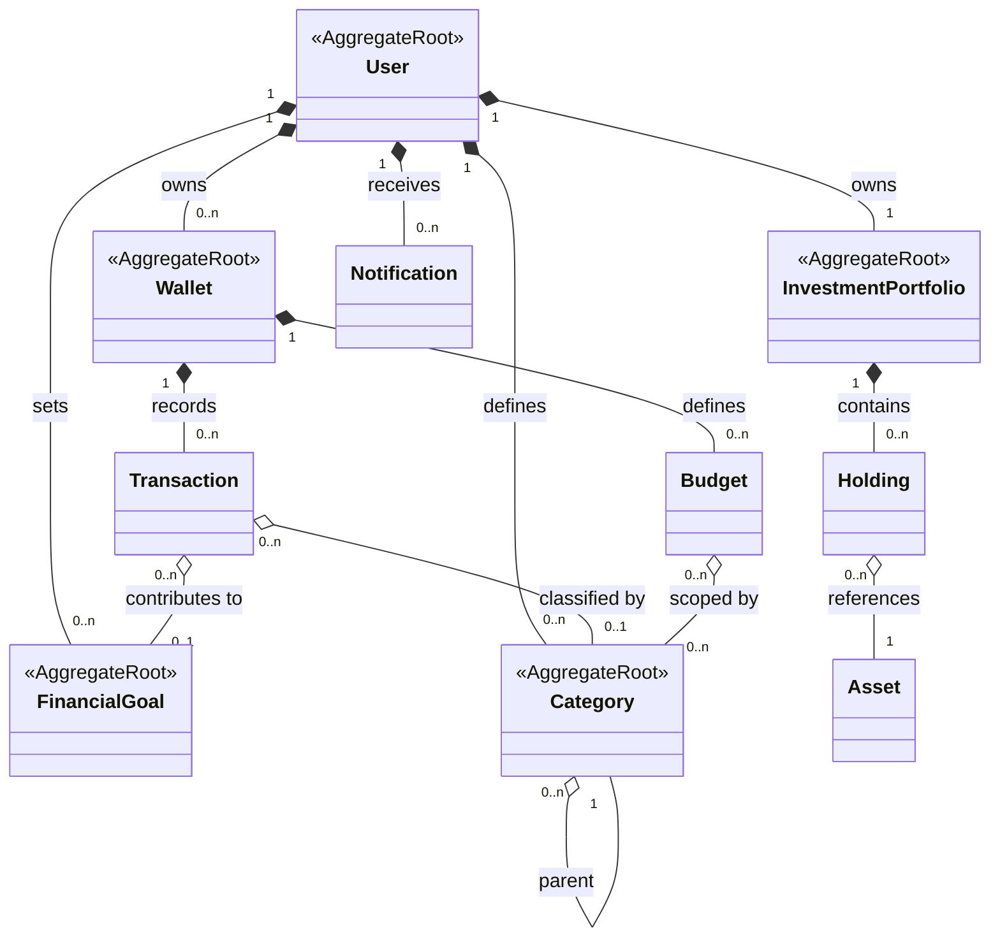

# Personal Finance Management (PFM) - Software Requirements Specification (SRS)


| Version | Date | Author | Change |
|---------|------|--------|--------|
| 1.0 | 15-Jul-2026 | Homer Truong | Initial draft |
| 1.1 | 19-Jul-2026 | Homer Truong | Reordered System Security/User Management and renamed Features/User Stories to abbreviation IDs (e.g. `SS-US-01`) across §7 |

---

## Table of Contents

- [1. Introduction](#1-introduction)
  - [1.1 Purpose](#11-purpose)
  - [1.2 Scope](#12-scope)
  - [1.3 Assumptions and Constraints](#13-assumptions-and-constraints)
    - [1.3.1 Assumptions](#131-assumptions)
    - [1.3.2 Constraints](#132-constraints)
  - [1.4 Definitions and Acronyms](#14-definitions-and-acronyms)
  - [1.5 Roles and Actors](#15-roles-and-actors)
  - [1.6 Out of Scope](#16-out-of-scope)
  - [1.7 Related Documents](#17-related-documents)
- [2. Conceptual Domain Model](#2-conceptual-domain-model)
  - [2.1 Domain Diagram](#21-domain-diagram)
  - [2.2 Domain Entity](#22-domain-entity)
  - [2.3 Entity Relationship and Cardinality](#23-entity-relationship-and-cardinality)
  - [2.4 Business Rules](#24-business-rules)
- [3. Functional Requirements (FR)](#3-functional-requirements-fr)
  - [3.1 Wallet Management](#31-wallet-management)
  - [3.2 Transaction Management](#32-transaction-management)
  - [3.3 Category Management](#33-category-management)
  - [3.4 Budget Tracking](#34-budget-tracking)
  - [3.5 Financial Goal Tracking](#35-financial-goal-tracking)
  - [3.6 Investment Management](#36-investment-management)
  - [3.7 Financial Reporting](#37-financial-reporting)
  - [3.8 Data Overview Dashboard](#38-data-overview-dashboard)
- [4. Non-Functional Requirements (NFR)](#4-non-functional-requirements-nfr)
  - [4.1 Performance](#41-performance)
  - [4.2 Availability](#42-availability)
  - [4.3 Scalability](#43-scalability)
  - [4.4 Security](#44-security)
    - [4.4.1 Authentication](#441-authentication)
    - [4.4.2 Authorization](#442-authorization)
  - [4.5 Privacy](#45-privacy)
  - [4.6 Reliability](#46-reliability)
- [5. User Experience Requirements (UXR)](#5-user-experience-requirements-uxr)
  - [5.1 Clarity](#51-clarity)
  - [5.2 Fast Onboarding](#52-fast-onboarding)
  - [5.3 Immediate Feedback](#53-immediate-feedback)
- [6. Business Flows](#6-business-flows)
  - [6.1 Main Business Flow — End-to-End User Journey](#61-main-business-flow--end-to-end-user-journey)
  - [6.2 Supporting BF — Wallet Management](#62-supporting-bf--wallet-management)
  - [6.3 Supporting BF — Category Management](#63-supporting-bf--category-management)
  - [6.4 Supporting BF — Budget Management](#64-supporting-bf--budget-management)
  - [6.5 Supporting BF — Transaction Management](#65-supporting-bf--transaction-management)
  - [6.6 Supporting BF — Financial Goal Management](#66-supporting-bf--financial-goal-management)
  - [6.7 Supporting BF — Investment Management](#67-supporting-bf--investment-management)
  - [6.8 Supporting BF — Reporting and Dashboard](#68-supporting-bf--reporting-and-dashboard)
  - [6.9 Supporting BF — Notification Handling](#69-supporting-bf--notification-handling)
- [7. Features and User Stories](#7-features-and-user-stories)
  - [7.1 System Security (SS)](#71-system-security-ss)
    - [7.1.1 SS-US-01: Login (ADMIN, USER) [MVP]](#711-ss-us-01-login-admin-user-mvp)
    - [7.1.2 SS-US-02: Logout (ADMIN, USER) [MVP]](#712-ss-us-02-logout-admin-user-mvp)
  - [7.2 User Management (UM)](#72-user-management-um)
    - [7.2.1 UM-US-01: Create a User (ADMIN)](#721-um-us-01-create-a-user-admin)
    - [7.2.2 UM-US-02: Update a User Profile (USER)](#722-um-us-02-update-a-user-profile-user)
  - [7.3 Wallet Management (WM)](#73-wallet-management-wm)
    - [7.3.1 WM-US-01: Create a Wallet (USER) [MVP]](#731-wm-us-01-create-a-wallet-user-mvp)
    - [7.3.2 WM-US-02: View a list of Wallets (USER) [MVP]](#732-wm-us-02-view-a-list-of-wallets-user-mvp)
    - [7.3.3 WM-US-03: View a Wallet (USER) [MVP]](#733-wm-us-03-view-a-wallet-user-mvp)
    - [7.3.4 WM-US-04: Update a Wallet (USER)](#734-wm-us-04-update-a-wallet-user)
    - [7.3.5 WM-US-05: Set a Wallet as default (USER)](#735-wm-us-05-set-a-wallet-as-default-user)
  - [7.4 Category Management (CM)](#74-category-management-cm)
    - [7.4.1 CM-US-01: Create a Category (USER) [MVP]](#741-cm-us-01-create-a-category-user-mvp)
    - [7.4.2 CM-US-02: View a list of Categories (USER) [MVP]](#742-cm-us-02-view-a-list-of-categories-user-mvp)
    - [7.4.3 CM-US-03: View a Category (USER)](#743-cm-us-03-view-a-category-user)
    - [7.4.4 CM-US-04: Update a Category (USER)](#744-cm-us-04-update-a-category-user)
    - [7.4.5 CM-US-05: Delete a Category (USER)](#745-cm-us-05-delete-a-category-user)
  - [7.5 Budget Management (BM)](#75-budget-management-bm)
    - [7.5.1 BM-US-01: Create a Budget for a Wallet (USER) [MVP]](#751-bm-us-01-create-a-budget-for-a-wallet-user-mvp)
    - [7.5.2 BM-US-02: View a list of Budgets (USER) [MVP]](#752-bm-us-02-view-a-list-of-budgets-user-mvp)
    - [7.5.3 BM-US-03: View a Budget (USER) [MVP]](#753-bm-us-03-view-a-budget-user-mvp)
    - [7.5.4 BM-US-04: Update a Budget (USER)](#754-bm-us-04-update-a-budget-user)
    - [7.5.5 BM-US-05: Delete a Budget (USER)](#755-bm-us-05-delete-a-budget-user)
  - [7.6 Transaction Management (TM)](#76-transaction-management-tm)
    - [7.6.1 TM-US-01: Create a Transaction for a Wallet (USER) [MVP]](#761-tm-us-01-create-a-transaction-for-a-wallet-user-mvp)
    - [7.6.2 TM-US-02: View a list of Transactions (USER) [MVP]](#762-tm-us-02-view-a-list-of-transactions-user-mvp)
    - [7.6.3 TM-US-03: View a Transaction (USER) [MVP]](#763-tm-us-03-view-a-transaction-user-mvp)
    - [7.6.4 TM-US-04: Update a Transaction (USER)](#764-tm-us-04-update-a-transaction-user)
    - [7.6.5 TM-US-05: Delete a Transaction (USER)](#765-tm-us-05-delete-a-transaction-user)
  - [7.7 Financial Reporting (RPT)](#77-financial-reporting-rpt)
    - [7.7.1 RPT-US-01: View the Summary Report (USER) [MVP]](#771-rpt-us-01-view-the-summary-report-user-mvp)
    - [7.7.2 RPT-US-02: View Income Report (USER)](#772-rpt-us-02-view-income-report-user)
    - [7.7.3 RPT-US-03: View Expense Report (USER)](#773-rpt-us-03-view-expense-report-user)
    - [7.7.4 RPT-US-04: Filter Reports by Date (USER)](#774-rpt-us-04-filter-reports-by-date-user)
    - [7.7.5 RPT-US-05: Filter Reports by Wallet or Category (USER)](#775-rpt-us-05-filter-reports-by-wallet-or-category-user)
  - [7.8 Financial Goal (FG)](#78-financial-goal-fg)
    - [7.8.1 FG-US-01: Create a Financial Goal (USER)](#781-fg-us-01-create-a-financial-goal-user)
    - [7.8.2 FG-US-02: View a list of Financial Goals (USER)](#782-fg-us-02-view-a-list-of-financial-goals-user)
    - [7.8.3 FG-US-03: View a Financial Goal (USER)](#783-fg-us-03-view-a-financial-goal-user)
    - [7.8.4 FG-US-04: Update a Financial Goal (USER)](#784-fg-us-04-update-a-financial-goal-user)
    - [7.8.5 FG-US-05: Close a Financial Goal (USER)](#785-fg-us-05-close-a-financial-goal-user)
  - [7.9 Investment Portfolio (IP)](#79-investment-portfolio-ip)
    - [7.9.1 IP-US-01: View the Investment Portfolio (USER)](#791-ip-us-01-view-the-investment-portfolio-user)
    - [7.9.2 IP-US-02: Update the Investment Portfolio Settings (USER)](#792-ip-us-02-update-the-investment-portfolio-settings-user)
    - [7.9.3 IP-US-03: Add a Holding to the Investment Portfolio (USER)](#793-ip-us-03-add-a-holding-to-the-investment-portfolio-user)
    - [7.9.4 IP-US-04: Update a Holding (USER)](#794-ip-us-04-update-a-holding-user)
    - [7.9.5 IP-US-05: Remove a Holding (USER)](#795-ip-us-05-remove-a-holding-user)
  - [7.10 Notification Handling (NH)](#710-notification-handling-nh)
    - [7.10.1 NH-US-01: View the list of Notifications (USER) [MVP]](#7101-nh-us-01-view-the-list-of-notifications-user-mvp)
    - [7.10.2 NH-US-02: View a Notification (USER) [MVP]](#7102-nh-us-02-view-a-notification-user-mvp)
    - [7.10.3 NH-US-03: Mark a Notification as Read (USER)](#7103-nh-us-03-mark-a-notification-as-read-user)
  - [7.11 Data Overview Dashboard (DOD)](#711-data-overview-dashboard-dod)
  - [Feature-level Release (Overview)](#feature-level-release-overview)
- [8. External Dependencies](#8-external-dependencies)
  - [8.1 Third-Party APIs](#81-third-party-apis)
  - [8.2 Internal Systems / Legacy Services](#82-internal-systems--legacy-services)
  - [8.3 Infrastructure Dependencies](#83-infrastructure-dependencies)

---

## 1. Introduction

### 1.1 Purpose

This document defines the Software Requirements Specification (SRS) for the Personal Finance Management (PFM) application.

The purpose of this SRS is to:
- Describe the Functional, Non-Functional and User eXperience Requirements (FR, NFR, UXR) of the PFM product from a real-world product perspective.
- Serve as a baseline requirements document that can evolve over time as the product grows.
- Provide a realistic example of how requirements are specified and maintained in professional software development.

This SRS represents the overall product vision and requirements, independent of any specific release or implementation phase.

### 1.2 Scope

PFM is a software product designed to help individuals manage their personal finances in a structured, transparent, and effective way.

The PFM system aims to support Users in:
- Recording and organizing financial transactions (income and expenses).
- Managing wallets, categories, budgets, financial goals, and investments.
- Understanding financial behavior through reports and dashboards.
- Making better financial decisions based on historical data and insights.

This SRS describes the complete functional scope of the PFM product, including features that may be delivered across multiple releases (e.g. MVP, 1st release, 2nd release, and beyond).

Within the context of this course, PFM is used as a case study product to demonstrate how a real software product is:
- Analyzed from User needs and business goals,
- Defined through structured requirements,
- Incrementally delivered using an MVP-first approach.

While the course focuses on building and demonstrating an MVP implementation, this SRS remains the authoritative requirements document that continues to evolve as the product matures.

### 1.3 Assumptions and Constraints

#### 1.3.1 Assumptions

- The primary Users are individuals managing their personal finances.
- Users have basic familiarity with digital applications.
- Financial data is primarily provided by Users, with optional extensions for integrations in future releases.
- The PFM product will be developed and delivered incrementally over time.

#### 1.3.2 Constraints

- This SRS describes the full product requirements, not all of which are implemented in the MVP.
- Feature availability may vary by release, depending on priorities, resources, and learning objectives.
- Regulatory compliance, external financial integrations, and advanced analytics may be introduced progressively in later releases.
- Design and implementation details are intentionally excluded and will be addressed in separate Software Design Specifications (SDS).

### 1.4 Definitions and Acronyms

| Term | Definition |
|------|------------|
| PFM | Personal Finance Management |
| MVP | Minimum Viable Product |
| FR | Functional Requirement |
| NFR | Non-Functional Requirement |
| UXR | User Experience Requirement |

### 1.5 Roles and Actors

PFM is used within a family context, where one shared deployment (e.g. a home server on the household LAN) is used by multiple family members. Two roles participate:

| Role | Description | Example persona |
|------|-------------|-----------------|
| ADMIN | Sets up, deploys, and maintains the PFM application for the household (e.g. installing/running the app on the home LAN, creating accounts for family members). The ADMIN does not view or manage other members' financial data through this role — administration is limited to the application instance and accounts, not personal finances. | The family member who manages the home server/app instance |
| USER | An individual family member who records and manages their own personal finances independently within the shared application instance. Each USER's Wallets, Transactions, Budgets, Goals, and Investments are private to that USER (see §4.4.2 Authorization). | Dad, Mom, Sister, Brother |

> A single person may hold both roles (e.g. Dad administers the app and also uses it as a USER), but the two responsibilities are distinct.

### 1.6 Out of Scope

The following are explicitly excluded from this specification:

- **Multi-family / multi-tenant support.** The product is scoped to a single family/household running one shared deployment (§1.5, RUNBOOK). It is not a multi-organization SaaS product serving unrelated households from one instance.
- **Joint or shared financial entities.** Every Wallet, Category, Budget, and FinancialGoal belongs to exactly one User (§2.3 Composition rules) — there is no concept of a jointly-owned Wallet or Budget that multiple family members co-manage.
- **Cross-member financial visibility or oversight.** No role, including ADMIN, can view, aggregate, or report on another family member's financial data (§4.4.2). A family-wide combined dashboard or report spanning multiple Users is not supported.
- **Parental controls / spending approval workflows.** There is no mechanism for one family member (e.g. a parent) to approve, limit, or restrict another family member's (e.g. a child's) transactions or spending.
- **Remote/internet-facing access.** The deployment target is a home LAN only (RUNBOOK) — public hosting, HTTPS/domain setup, and access from outside the household network are not addressed.
- **Bank and institution integrations.** Automatic transaction import (open banking, bank feeds, card sync) is not supported; all Transactions are entered manually by the User (§1.3.1).
- **Live market data feeds.** Asset current market price (§2.2) is a stored, manually-maintained attribute — automated/real-time price fetching from external market data providers is out of scope.
- **External notification channels.** Notification (§2.2) is in-app only; email, SMS, and push notifications are not covered.
- **Self-service account recovery.** Password reset / account recovery flows (e.g. via email or SMS) are not addressed; account issues are handled manually by the ADMIN (RUNBOOK §8).
- **Tax and regulatory features.** Tax filing support and multi-currency conversion using live FX rates are not covered.

### 1.7 Related Documents


| Document | Location | Purpose |
|----------|----------|---------|
| SDS | [SDS.md](SDS.md) | Software Design Specification — architecture and API design |
| RUNBOOK | [RUNBOOK.md](RUNBOOK.md) | Operational guide — how the ADMIN deploys and runs the PFM app on a household LAN so every family member (USER) can reach it from their own device; also covers account setup, backup, and troubleshooting |

---

## 2. Conceptual Domain Model

> This section defines the "Universe of Discourse" — the real-world entities, their relationships,
> and business rules governing them. It uses business terminology only; implementation details
> (DB types, PKs, API field names) belong in the SDS.
>
> **Sync obligation:** whenever a user story in §7 introduces, renames, or removes a domain
> concept, this section MUST be updated in the same PR. Record the last review below.
>
> **Last synced with §7 User Stories:** {YYYY-MM-DD}

### 2.1 Domain Diagram



> **Notation:**
> - `*--` Solid diamond (◆) — **Composition**: child cannot exist without parent (strict lifecycle — deleted when the parent is deleted).
> - `o--` Hollow diamond (◇) — **Aggregation**: child exists independently (loose reference, no cascade delete). The referencing side — whichever class holds the pointer/FK and needs to navigate to the other — is written first and carries the diamond, regardless of which side is "1" or "N"; this notation is about delete-cascade behavior, not classic whole-part containment.

>
> **Aggregate Roots:** User, Wallet, InvestmentPortfolio, FinancialGoal, and Category are the aggregate roots — each is the single entry point for its cluster of related entities, marked with `<<AggregateRoot>>` above.

### 2.2 Domain Entity 

| Entity | Description | Key Business Attributes | Ownership / Lifecycle |
|--------|-------------|-------------------------|-----------------------|
| User | A family member account, created by the ADMIN, that uses the PFM system to manage their personal finances. | Full name, email, account creation date | Independent — Aggregate Root; all personal financial data is anchored to this entity |
| Wallet | A named representation of a real-world financial account, cash reserve, or e-wallet that holds a current balance. | Name, type (cash / bank / e-wallet), current balance, currency, default flag | Owned by User — deleted when the User is deleted |
| Transaction | A financial event recorded against a Wallet, representing money flowing in (income) or out (expense). | Type (income / expense), amount, date, note, associated category | Part of Wallet — deleted when the Wallet is deleted |
| Category | A user-defined label used to classify Transactions and scope Budgets; may be organized hierarchically with a parent Category. | Name, applicable type (income / expense / both), parent category | Owned by User — deleted when the User is deleted; persists independently of any Transaction or Budget that references it |
| Budget | A spending limit set for one or more Categories within a Wallet for a specific time period, used to track and control expenses. | Period (e.g. monthly), limit amount, total spent, remaining amount | Part of Wallet — deleted when the Wallet is deleted |
| FinancialGoal | A savings or spending target that a User defines with a monetary goal and a deadline to work toward. | Name, target amount, target date, current progress amount | Owned by User — deleted when the User is deleted |
| InvestmentPortfolio | A single container per User that groups all investment Holdings and provides a high-level view of investment performance. | Name, total current value, portfolio settings | Part of User (1:1) — created when the ADMIN creates the User account, deleted when User is deleted |
| Holding | A single investment position inside an InvestmentPortfolio, representing an amount invested in a specific Asset. | Asset reference, quantity, purchase price, current value | Part of InvestmentPortfolio — deleted when the InvestmentPortfolio is deleted |
| Asset | A tradable or investable instrument (e.g. stock, fund, crypto) that can be referenced by one or more Holdings. | Name, ticker / symbol, asset type, current market price | Independent — shared reference; exists regardless of whether any Holding references it |
| Notification | A system-generated message that alerts the User to a relevant financial event or condition (e.g. budget limit reached). | Message content, notification type, read status, triggered date | Part of User — deleted when the User is deleted |

> **Tip:** "Key Business Attributes" are the properties a domain expert would use to describe the
> entity — e.g., for *Customer Session*: `product viewed, signals captured, intent score`.
> Avoid DB column names here.

### 2.3 Entity Relationship and Cardinality

| Subject | Verb Phrase | Object | Type | Cardinality | Constraint |
|---------|-------------|--------|------|-------------|------------|
| User | owns | Wallet | Composition | 1 User → 0..n Wallets | A Wallet belongs to exactly one User and is deleted when that User is deleted |
| User | owns | InvestmentPortfolio | Composition | 1 User → 1 InvestmentPortfolio | Exactly one portfolio per User; created on registration and deleted with the User |
| User | receives | Notification | Composition | 1 User → 0..n Notifications | Notifications are private to the User and deleted when the User is deleted |
| User | sets | FinancialGoal | Composition | 1 User → 0..n FinancialGoals | A FinancialGoal belongs to exactly one User and is deleted when that User is deleted |
| User | defines | Category | Composition | 1 User → 0..n Categories | A Category belongs to exactly one User and is deleted when that User is deleted; it is not shared across family members |
| Wallet | records | Transaction | Composition | 1 Wallet → 0..n Transactions | A Transaction belongs to exactly one Wallet and is deleted when that Wallet is deleted |
| Wallet | defines | Budget | Composition | 1 Wallet → 0..n Budgets | A Budget belongs to exactly one Wallet and is deleted when that Wallet is deleted |
| InvestmentPortfolio | contains | Holding | Composition | 1 InvestmentPortfolio → 0..n Holdings | Holdings are deleted when the InvestmentPortfolio is deleted |
| Holding | references | Asset | Aggregation | 0..n Holdings → 1 Asset | An Asset exists independently; a Holding must reference exactly one Asset but deleting the Holding does not affect the Asset |
| Transaction | classified by | Category | Aggregation | 0..n Transactions → 0..1 Category | Category assignment is optional; deleting a Category does not delete its Transactions (they become uncategorized) |
| Transaction | contributes to | FinancialGoal | Aggregation | 0..n Transactions → 0..1 FinancialGoal | A FinancialGoal exists independently; a Transaction may optionally be linked to one Goal to track progress |
| Budget | scoped by | Category | Aggregation | 0..n Budgets → 0..n Categories | A Budget tracks spending across its associated Categories; deleting a Category does not delete the Budget |
| Category | child of | Category | Aggregation | 0..n Categories → 1 parent Category | A Category may have at most one parent (sub-category hierarchy); root-level Categories have no parent; a Category's parent MUST belong to the same User (see BR-06) |

> **Type** must match the diagram notation. A Composition row means the child row in §2.1 uses `*--`.

### 2.4 Business Rules

> Business rules are invariants that the system must always enforce, regardless of which feature or
> user story triggers them. They are distinct from acceptance criteria (which are story-specific).
> Each rule here should be traceable to at least one AC in §7 or one FR in §3.

| Rule ID | Statement | Entities Involved | Enforced In |
|---------|-----------|-------------------|-------------|
| BR-01 | A Wallet MUST belong to exactly one User; it MUST NOT be shared or transferred between Users. | User, Wallet | §3.1 |
| BR-02 | A Wallet MUST always have a name, a type (cash / bank / e-wallet), and a current balance. | Wallet | §3.1 |
| BR-03 | A Transaction MUST specify an amount, a type (income or expense), a date, and exactly one Wallet; it MUST NOT exist without an associated Wallet. | Transaction, Wallet | §3.2 |
| BR-04 | A Transaction's Category, if assigned, MUST belong to the same User who owns the Transaction's Wallet. | Transaction, Category, Wallet, User | §3.2, §3.3 |
| BR-05 | A Category MUST have a name and an applicable type (income / expense / both); deleting a Category MUST NOT delete the Transactions previously classified under it (they become uncategorized). | Category, Transaction | §3.3 |
| BR-06 | A Category's parent Category, if set, MUST belong to the same User as the child Category — an entire Category tree MUST belong to a single User; cross-User parent links are prohibited. | Category, User | §3.3 |
| BR-07 | A Budget MUST be scoped to exactly one Wallet, one or more Categories, and a defined period (e.g. monthly). | Budget, Wallet, Category | §3.4 |
| BR-08 | The System MUST compute a Budget's actual spending from the Transactions in its scoped Categories and indicate whether the User is within or exceeding the limit. | Budget, Transaction, Category | §3.4 |
| BR-09 | A FinancialGoal MUST have a target amount and a target date, and MUST belong to exactly one User. | FinancialGoal, User | §3.5 |
| BR-10 | The System MUST derive a FinancialGoal's progress only from Transactions explicitly linked to that Goal. | FinancialGoal, Transaction | §3.5 |
| BR-11 | Every Holding MUST reference exactly one Asset and MUST belong to the User's single InvestmentPortfolio. | Holding, Asset, InvestmentPortfolio, User | §3.6 |
| BR-12 | A Financial Report MUST be computed only from the requesting User's own Wallets, Transactions, and Categories. | User, Wallet, Transaction, Category | §3.7 |
| BR-13 | The Dashboard MUST display only the current User's own Wallets, Transactions, Budgets, and Goals. | User, Wallet, Transaction, Budget, FinancialGoal | §3.8 |

---

## 3. Functional Requirements (FR)

> Each FR subsection describes **what** the system must do in business terms. Include a **Rationale** to explain **why** — the business driver, user need, or risk the requirement addresses. Implementation details belong in the SDS.

### 3.1 Wallet Management

**Rationale:** Users need a way to represent and track different sources of money so that all financial activities can be properly organized and traced back to a specific account or fund.

The System shall allow Users to create and manage one or more Wallets representing different sources of money (e.g. cash, bank account, e-wallet).
Each wallet shall store basic information such as Wallet name, type, and current balance.
Wallets are used as the main source or destination for all financial transactions.

### 3.2 Transaction Management

**Rationale:** Recording income and expense transactions is the core activity of personal finance management, enabling Users to track where money comes from and where it goes.

The System shall allow Users to record financial Transactions, including both income and expense Transactions.
Each Transaction shall include at least the amount, transaction type (income or expense), date, Wallet, and Category.
Users should be able to view, edit, and delete Transactions.

### 3.3 Category Management

**Rationale:** Categories enable Users to classify and group transactions meaningfully, which is essential for budgeting and financial reporting.

The System shall allow Users to classify Transactions into User-defined Categories (e.g. Study, Food, Rent, Salary, Investment…).
Categories are used to organize Transactions and support budgeting and reporting features.

### 3.4 Budget Tracking

**Rationale:** Budgets allow Users to set spending limits per category, helping them stay within financial plans and identify overspending.

The System shall allow Users to define a Budget for each Category within a specific period (e.g. monthly).
The System shall track actual spending against the defined Budget and indicate whether the User is within or exceeding the Budget.

### 3.5 Financial Goal Tracking

**Rationale:** Financial goals give Users a concrete target to work toward, providing motivation and a measurable sense of progress.

The System shall allow Users to define Financial Goals (e.g. saving for emergency fund, travel, or major purchases).
Each Goal shall include a target amount and a target time frame.
The System shall track progress toward each Goal based on recorded Transactions.

### 3.6 Investment Management

**Rationale:** Users with investment activities need a way to record and monitor their investment holdings at a high level alongside their other financial data.

The System shall allow Users to record and track Investment-related information.
Investments may include basic details such as investment name, amount, and current value.
The purpose is to provide a high-level view of Investment performance, not detailed trading features.

### 3.7 Financial Reporting

**Rationale:** Reports help Users understand their financial behavior over time, enabling better decision-making based on historical data.

The System shall provide basic Financial Reports to help Users understand their financial situation.
Reports may include summaries of income and expenses, spending by Category, Wallet balances, and overall financial trends over time.

### 3.8 Data Overview Dashboard

**Rationale:** A dashboard gives Users an at-a-glance view of their financial health, reducing the need to navigate through multiple sections for essential information.

The System shall provide a dashboard that presents key financial information in a clear and easy-to-understand format.
The dashboard may include current balances, recent Transactions, Budget status, and Goal progress.

---

## 4. Non-Functional Requirements (NFR)

> Each NFR must carry a **measurable target** — a concrete number or threshold verifiable in testing. Prose descriptions without targets will be rejected at review.

### 4.1 Performance

| Metric | Target |
|--------|--------|
| Basic operations (viewing Wallets, adding Transactions, viewing Reports) | Performed smoothly without noticeable delay under normal usage conditions |

The System shall respond to User actions within an acceptable time under normal usage conditions.

### 4.2 Availability

| Environment | Uptime target |
|-------------|---------------|
| Production | 99% (excluding planned maintenance) |
| Staging / test | {X%} |

### 4.3 Scalability

| Dimension | POC target | MVP target | Production target |
|-----------|-----------|-----------|------------------|
| Concurrent sessions | {N} | {N} | {N} |

The System shall be designed in a way that allows future expansion of features and Users.
New modules such as advanced reporting or investment analytics should be added without major changes to existing functionality.

### 4.4 Security

#### 4.4.1 Authentication

The System shall protect User financial data from unauthorized access through User authentication.

#### 4.4.2 Authorization

The System shall enforce data isolation between Users so that each User can access only their own financial data.

### 4.5 Privacy

- The System shall ensure that personal and financial data of Users are not shared or exposed without explicit User consent.
- **Data Residency:** {Specify the geographic region(s) where personal data must be stored/processed.}

### 4.6 Reliability

| Failure scenario | Expected system behaviour |
|------------------|--------------------------|
| Application restart | User data remains consistent and accurate |
| Temporary unavailability | User data remains consistent and accurate upon restoration |

The System shall operate reliably during normal usage and handle common User actions without unexpected failures.

---

## 5. User Experience Requirements (UXR)

### 5.1 Clarity

The System shall present information in a clear manner.
Users should be able to understand their financial situation at a glance without needing explanations or instructions.

### 5.2 Fast Onboarding

The System shall allow new Users to start using core features quickly.
A first-time User should be able to create a Wallet and record the first Transaction within a few minutes.

### 5.3 Immediate Feedback

The System shall provide clear and immediate feedback for User actions.
After adding or editing data, Users should instantly see updated balances, budgets, or progress indicators.

---

## 6. Business Flows

> These flows describe end-to-end journeys at a business level. Each named flow should include its happy path, alternative paths, and failure/negative cases.

### 6.1 Main Business Flow — End-to-End User Journey

This flow describes the typical end-to-end interaction of a User with the PFM system during daily financial management.

1. A predefined ADMIN (seeded via a migration/setup script — see RUNBOOK §8) creates a new User account for a family member. There is no self-service registration; a User cannot create their own account.
2. The User logs into the System.
3. The User creates a Wallet W1 (e.g. Cash Wallet).
4. The User creates a Category C1 (e.g. Salary), C2 (e.g. Food).
5. The User defines a Budget B1 for Category C2 associated with Wallet W1.
6. The User records an income Transaction T1 into wallet W1 under C1.
7. The User records an expense Transaction T2 from Wallet W1 under Category C2.
8. The User views the current status of Wallet W1.
9. The User views the current status of Budget B1.
10. The User views the income and expense Report.
11. The User views Notifications if any Budget limit or condition is reached.
12. The User logs out of the System.

### 6.2 Supporting BF — Wallet Management

This flow describes how Users manage Wallets as sources of money.

1. The User views the list of all Wallets.
2. The User selects a Wallet W1 to view details.
3. The User updates a Wallet if needed.

### 6.3 Supporting BF — Category Management

This flow describes how Users manage Transaction Categories.

1. The User views the list of available Categories.
2. The User selects a Category C1 to view details.
3. The User updates a Category if needed.
4. The User deletes a Category that is no longer in use.

### 6.4 Supporting BF — Budget Management

This flow describes how Users plan and monitor Budgets.

1. The User views the list of Budgets associated with a Wallet.
2. The User views detailed Budget status and remaining amount.
3. The User updates a Budget if needed.
4. The User deletes a Budget when it is no longer required.

### 6.5 Supporting BF — Transaction Management

This flow describes how Users record financial activities.

1. The User views the list of Transactions associated with a Wallet.
2. The User views details of a Transaction.
3. The User updates Transaction information if needed.
4. The User deletes a Transaction when it is no longer required.

### 6.6 Supporting BF — Financial Goal Management

This flow describes how Users manage Financial Goals.

1. The User creates a Financial Goal with a target amount and time frame.
2. The User allocates funds to the Goal.
3. The User views Goal progress status.
4. The User updates the Goal if needed.
5. The User closes the Goal when completed.

### 6.7 Supporting BF — Investment Management

This flow describes how Users track Investments.

1. The User creates an Investment record.
2. The User records Investment-related Transactions.
3. The User views a summary of Investment performance.

### 6.8 Supporting BF — Reporting and Dashboard

This flow describes how Users review financial information.

1. The User accesses the dashboard or reporting section.
2. The User filters reports by date, Wallet, or Category.

### 6.9 Supporting BF — Notification Handling

This flow describes how the System communicates important events.

1. The User views the list of Notifications.
2. The User views a Notification.
3. The User takes appropriate action on a Notification if needed.

> **Forward traceability:** every step in a flow that requires a user action or a system decision
> MUST map to at least one User Story in §7. If a step has no corresponding story, either the
> story is missing or the step is purely internal — document which in a note on the step.

---

## 7. Features and User Stories

> **Derivation principle:** Features and User Stories are derived from two upstream sources —
> do not invent features that cannot be traced to one of these. If a feature has no trace,
> update §2 or §6 first.
>
> | Source | Drives | Typical story actions |
> |--------|--------|-----------------------|
> | **§2 Domain Entities** | Data-centric features | Create, view, update, delete an entity; trigger a state transition (§2.3) |
> | **§6 Business Flows** | Journey-centric features | Actor performs a step in a named flow; system responds to a flow event |
>
> A Feature that cannot be traced to either source is a signal that §2 or §6 is incomplete —
> update those sections before writing the stories.
>
> **User story format:** **As a** {ROLE}, **I want to** {action} **so that** {value}.
>
> All domain nouns used in stories MUST be defined in §2.2.
> All business rules cited in acceptance criteria MUST have a BR-{nn} entry in §2.4.

---

### 7.1 System Security (SS)

Ensures secure access to the System by allowing Users to log in and log out safely, protecting personal financial data. Moreover, each User is authorized to see only his/her financial data.

#### 7.1.1 SS-US-01: Login (ADMIN, USER) [MVP]

#### 7.1.2 SS-US-02: Logout (ADMIN, USER) [MVP]

---

### 7.2 User Management (UM)

Provides User account provisioning by the ADMIN and profile management by the User. There is no self-service registration (§1.6 Out of Scope) — a User account can only be created by the ADMIN.

#### 7.2.1 UM-US-01: Create a User (ADMIN)

**As an** ADMIN, **I want to** create a new User account for a family member **so that** they can log in and use the PFM application.

**Acceptance Criteria:**

```gherkin
Background:
  Given the ADMIN is on the "Create User" screen

Scenario: Create a User account successfully
  When the ADMIN enters full name "Homer Truong"
    And the ADMIN enters email "homer@example.com"
    And the ADMIN enters an initial password
    And the ADMIN taps "Create"
  Then the System creates a new User account
    And the System shows message "User account created"
    And the new User can log in with the assigned email and initial password

Scenario: Reject creation when required fields are missing
  When the ADMIN taps "Create" without entering email
  Then the System does not create a new User account
    And the System shows validation error "Email is required"

Scenario: Reject creation when account already exists
  Given an existing User account with email "homer@example.com"
  When the ADMIN enters full name "Homer Truong"
    And the ADMIN enters email "homer@example.com"
    And the ADMIN enters an initial password
    And the ADMIN taps "Create"
  Then the System does not create a new User account
    And the System shows error "Account already exists"
```

#### 7.2.2 UM-US-02: Update a User Profile (USER)

---

### 7.3 Wallet Management (WM)

Allows Users to create and manage Wallets that represent different sources of money and view current balances.

#### 7.3.1 WM-US-01: Create a Wallet (USER) [MVP]

#### 7.3.2 WM-US-02: View a list of Wallets (USER) [MVP]

#### 7.3.3 WM-US-03: View a Wallet (USER) [MVP]

#### 7.3.4 WM-US-04: Update a Wallet (USER)

#### 7.3.5 WM-US-05: Set a Wallet as default (USER)

---

### 7.4 Category Management (CM)

Enables Users to define and manage Categories used to classify income and expense Transactions.

#### 7.4.1 CM-US-01: Create a Category (USER) [MVP]

#### 7.4.2 CM-US-02: View a list of Categories (USER) [MVP]

#### 7.4.3 CM-US-03: View a Category (USER)

#### 7.4.4 CM-US-04: Update a Category (USER)

#### 7.4.5 CM-US-05: Delete a Category (USER)

---

### 7.5 Budget Management (BM)

Allows Users to plan and monitor spending by defining Budgets for specific Categories and Wallets.

#### 7.5.1 BM-US-01: Create a Budget for a Wallet (USER) [MVP]

#### 7.5.2 BM-US-02: View a list of Budgets (USER) [MVP]

#### 7.5.3 BM-US-03: View a Budget (USER) [MVP]

#### 7.5.4 BM-US-04: Update a Budget (USER)

#### 7.5.5 BM-US-05: Delete a Budget (USER)

---

### 7.6 Transaction Management (TM)

Enables Users to record, view, and manage income and expense Transactions associated with their Wallets.

#### 7.6.1 TM-US-01: Create a Transaction for a Wallet (USER) [MVP]

**As a** User, **I want to** create a transaction for a wallet **so that** I can track my income and expenses and keep wallet balance updated.

**Acceptance Criteria:**

```gherkin
Background:
  Given the User is logged in
   And the User has an existing wallet named "Main Wallet"
   And the wallet currency is "VND"
   And the wallet current balance is 1,000,000

Scenario: Create an expense transaction successfully
  Given the User is on the "Create Transaction" screen for "Main Wallet"
  When the User selects transaction type "Expense"
   And the User enters amount 200,000
   And the User selects category "Food"
   And the User sets date "2025-12-23"
   And the User enters note "Lunch"
   And the User taps "Save"
  Then the System creates a transaction in "Main Wallet"
   And the transaction type is "Expense"
   And the transaction amount is 200,000
   And the transaction category is "Food"
   And the transaction date is "2025-12-23"
   And the System decreases the wallet balance to 800,000
   And the System shows message "Transaction created successfully"

Scenario: Create an income transaction successfully
  Given the User is on the "Create Transaction" screen for "Main Wallet"
  When the User selects transaction type "Income"
   And the User enters amount 500,000
   And the User selects category "Salary"
   And the User sets date "2025-12-23"
   And the User taps "Save"
  Then the System creates a transaction in "Main Wallet"
   And the transaction type is "Income"
   And the transaction amount is 500,000
   And the transaction category is "Salary"
   And the transaction date is "2025-12-23"
   And the System increases the wallet balance to 1,500,000
   And the System shows message "Transaction created successfully"

Scenario: Reject transaction when required fields are missing
  Given the User is on the "Create Transaction" screen for "Main Wallet"
  When the User taps "Save" without entering amount
  Then the System does not create a transaction
   And the System shows validation error "Amount is required"

Scenario: Reject transaction when amount is invalid
  Given the User is on the "Create Transaction" screen for "Main Wallet"
  When the User selects transaction type "Expense"
   And the User enters amount -10,000
   And the User taps "Save"
  Then the System does not create a transaction
   And the System shows validation error "Amount must be greater than 0"

Scenario: Reject expense transaction when balance is insufficient (MVP rule)
  Given the User is on the "Create Transaction" screen for "Main Wallet"
  When the User selects transaction type "Expense"
   And the User enters amount 2,000,000
   And the User selects category "Shopping"
   And the User taps "Save"
  Then the System does not create a transaction
   And the wallet balance remains 1,000,000
   And the System shows error "Insufficient balance"
```

#### 7.6.2 TM-US-02: View a list of Transactions (USER) [MVP]

#### 7.6.3 TM-US-03: View a Transaction (USER) [MVP]

#### 7.6.4 TM-US-04: Update a Transaction (USER)

#### 7.6.5 TM-US-05: Delete a Transaction (USER)

---

### 7.7 Financial Reporting (RPT)

Provides Users with summarized financial information and reports to help them understand their overall financial situation.

#### 7.7.1 RPT-US-01: View the Summary Report (USER) [MVP]

#### 7.7.2 RPT-US-02: View Income Report (USER)

#### 7.7.3 RPT-US-03: View Expense Report (USER)

#### 7.7.4 RPT-US-04: Filter Reports by Date (USER)

#### 7.7.5 RPT-US-05: Filter Reports by Wallet or Category (USER)

---

### 7.8 Financial Goal (FG)

Allows Users to define financial Goals and track progress toward achieving them.

#### 7.8.1 FG-US-01: Create a Financial Goal (USER)

#### 7.8.2 FG-US-02: View a list of Financial Goals (USER)

#### 7.8.3 FG-US-03: View a Financial Goal (USER)

#### 7.8.4 FG-US-04: Update a Financial Goal (USER)

#### 7.8.5 FG-US-05: Close a Financial Goal (USER)

---

### 7.9 Investment Portfolio (IP)

Enables Users to record and monitor investment information inside their single Investment Portfolio (Investment Index) to get a basic performance overview.

#### 7.9.1 IP-US-01: View the Investment Portfolio (USER)

#### 7.9.2 IP-US-02: Update the Investment Portfolio Settings (USER)

#### 7.9.3 IP-US-03: Add a Holding to the Investment Portfolio (USER)

#### 7.9.4 IP-US-04: Update a Holding (USER)

#### 7.9.5 IP-US-05: Remove a Holding (USER)

---

### 7.10 Notification Handling (NH)

Informs Users about important financial events or system conditions through Notifications.

#### 7.10.1 NH-US-01: View the list of Notifications (USER) [MVP]

#### 7.10.2 NH-US-02: View a Notification (USER) [MVP]

#### 7.10.3 NH-US-03: Mark a Notification as Read (USER)

---

### 7.11 Data Overview Dashboard (DOD)

---

### Feature-level Release (Overview)

The following table shows how the complete product scope defined in the SRS is delivered incrementally.
The MVP includes eight core features to ensure a usable and valuable first release, while additional features are introduced in later releases as the product evolves.

| No. | Feature | MVP | Release 1 | Release 2 | Note |
|-----|---------|-----|-----------|-----------|------|
| 1 | System Security | ✔ | ✔ | ✔ | Authentication, authorization, and data protection |
| 2 | User Management | ✔ | ✔ | ✔ | Core user identity and profile management |
| 3 | Wallet Management | ✔ | ✔ | ✔ | Core financial structure |
| 4 | Category Management | ✔ | ✔ | | Basic categorization is sufficient for early stages |
| 5 | Budget Management | ✔ | ✔ | ✔ | Essential for spending control and planning |
| 6 | Transaction Management | ✔ | ✔ | ✔ | Core financial activities |
| 7 | Financial Reporting | ✔ | ✔ | ✔ | Insights improve progressively over releases |
| 8 | Financial Goal | | ✔ | ✔ | Depends on stable budgeting and reporting |
| 9 | Investment Management | | | ✔ | Advanced feature for mature users |
| 10 | Notification Handling | ✔ | ✔ | ✔ | User feedback and engagement |
| 11 | Data Overview Dashboard | | ✔ | ✔ | High-level financial insights |

---

## 8. External Dependencies

### 8.1 Third-Party APIs

| Dependency | Provider | Purpose | Failure mode |
|------------|----------|---------|--------------|
| {Name} | {Vendor} | {Purpose} | {Impact} |

### 8.2 Internal Systems / Legacy Services

| Dependency | Owner team | Purpose | Failure mode |
|------------|-----------|---------|--------------|
| {Name} | {Team} | {Purpose} | {Impact} |

### 8.3 Infrastructure Dependencies

| Dependency | Type | Purpose | Failure mode |
|------------|------|---------|--------------|
| {Name} | {Managed} | {Purpose} | {Impact} |
