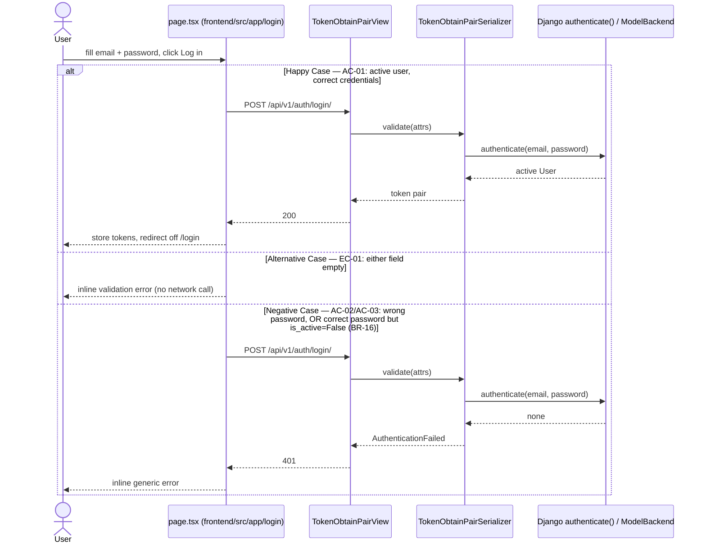

# Implementation Plan: System Security

**Branch**: `001-system-security` | **Spec**: [spec.md](spec.md)

**Input**: Feature specification from `specs/001-system-security/spec.md`

**User Stories covered by this plan**:

| Story | Status | Last updated |
|---|---|---|
| SS-US-01: Login | ✅ Designed & implemented | 2026-07-21 |
| SS-US-02: Logout | Not yet designed | — |

> This plan covers the whole **System Security** feature, not a single User Story — per aif-sdlc.md's Design Step, `plan.md` is created once per feature folder and *extended* (not replaced) each time a new US in this feature goes through `/speckit-plan`. `## Technical Context`, `## Constitution Check`, `## Project Structure`, and `## Complexity Tracking` below are feature-wide and will grow rows/entries as SS-US-02 (and beyond) are designed. Each User Story's own narrative (Summary + Sequence Diagram) gets its own `### SS-US-NN` subsection under **User Story Plans** so they don't blend together.

## User Story Plans

### SS-US-01: Login

**Summary**: Authenticate an ADMIN or USER by email + password and issue a JWT access/refresh credential pair, so the caller can reach the account and the actions permitted to their role(s) (AC-01). The backend side of this already exists as-is: `djangorestframework-simplejwt`'s stock `TokenObtainPairView` is wired at `POST /api/v1/auth/login/` (`backend/config/api_router.py`), and Django's default `ModelBackend` already refuses to authenticate a deactivated account (`is_active=False`), which is exactly BR-16/AC-03. No new backend service module is introduced — this is a case of AR-01's "straightforward CRUD/auth" threshold, not a multi-model side-effecting operation. What's actually missing is (1) a frontend login page — none exists yet under `frontend/src/app/` — and (2) test coverage + SDS documentation for the already-working endpoint.

**Sequence Diagram**: covers AC-01 (success), AC-02/AC-03 (generic rejection — wrong credentials and deactivated account both take the same path), and EC-01 (missing field, rejected before any network call).



### SS-US-02: Logout

*(Not yet designed — add a `### SS-US-02: Logout` Summary + Sequence Diagram here when this US goes through the Design Step.)*

## Technical Context

**Language/Version**: Python 3.12 (Django 6.0.7) for backend; TypeScript 5 (Next.js 16.2.10, React 19.2.4) for frontend

**Primary Dependencies**: Django REST Framework 3.17.1, `djangorestframework-simplejwt` 5.5.1 (backend, already installed and wired); no new frontend dependency — native `fetch` + React state per FE-02/FE-08 (no HTTP client, no form library)

**Storage**: SQLite (MVP) — `users` table already exists (`AUTH_USER_MODEL = 'users.User'`), no schema change required for this US

**Testing**: `python manage.py test` (DRF `APITestCase`, real throwaway test DB per constitution's Integration Testing Over Mocking) — no frontend test runner is set up yet, so the login page is verified manually per CLAUDE.md's "test in a browser" guidance

**Target Platform**: Single-machine home-LAN deployment (RUNBOOK.md) — backend :8000, frontend :3000

**Project Type**: Web application (frontend + backend), matching Option 2 below

**Performance Goals**: None beyond SRS §4 defaults (no story-specific target; login is a single low-frequency request, not a hot path)

**Constraints**: Access token lifetime 1 hour / refresh token lifetime 7 days (`SIMPLE_JWT` in `config/settings.py`, already fixed by constitution API-07) — not to be changed by this US

**Scale/Scope**: Single shared home-LAN instance, small fixed number of family-member accounts (SRS §1.4) — no concurrency/load design needed

## Constitution Check

*GATE: Must pass before Phase 0 research. Re-check after Phase 1 design.*

| Principle | Status | Notes |
|---|---|---|
| AR-01 Service Layer for Non-Trivial Business Logic | ✅ PASS | Login is single-model, no side effects on other Aggregates → stays in the stock DRF/SimpleJWT view, no new `services.py` needed |
| AR-02 Thin Views | ✅ PASS | `TokenObtainPairView` is already thin; no custom view logic introduced |
| AR-03 Django ORM Is the Repository | ✅ PASS | No repository abstraction introduced |
| AR-05 Transactional Atomicity | N/A | Single read, no multi-model write |
| AC-01/AC-02 Role-Based Access, Backend Enforces Authorization | ✅ PASS (scoped) | Login itself grants no role-specific permissions yet — AC-04 (dual role, single login) holds today only because no endpoint anywhere enforces Role-based gating yet (documented "known open drift": `Role` entity not scaffolded). Building Role/RBAC is out of scope for SS-US-01 |
| API-02 Response Shape — DRF-Native | ✅ PASS | `TokenObtainPairView` returns the stock `{access, refresh}` body, no custom envelope |
| API-04 HTTP Status Mapping | ✅ PASS | 200 success, 401 for bad credentials/deactivated account (SimpleJWT default) |
| API-07 Authentication | ✅ PASS | Already the fixed mechanism this US formalizes |
| Simplicity Over Premature Scale | ✅ PASS | Explicitly rejects adding an `AuthenticationService` module (see Summary) |
| VL-01 Backend Is Source of Truth | ✅ PASS | Frontend HTML5 required-field checks are UX-only; DRF/SimpleJWT validation is authoritative |
| DOD-02 API Contract Documented | ✅ RESOLVED | `POST /auth/login/` (API-SS-01) and `POST /auth/refresh/` (API-SS-02) added to SDS §6.3 API Index and §6.4.7/§6.4.8 API Specification during the Implementation Step (tasks.md T014) |
| Cross-Document Consistency (BR-16 mapping) | ✅ RESOLVED | SDS §4.3.3's BR-16 row corrected during the Implementation Step (tasks.md T015) to name Django's `ModelBackend.user_can_authenticate()`, invoked transparently by `TokenObtainPairSerializer.validate()`, instead of the nonexistent `AuthenticationService` |

No unjustified violations — Complexity Tracking table is empty.

## Project Structure

### Documentation (this feature)

```text
specs/001-system-security/
├── plan.md              # This file
├── research.md          # Phase 0 output
├── data-model.md         # Phase 1 output
├── quickstart.md         # Phase 1 output
├── contracts/            # Phase 1 output
│   └── auth-login.md
└── tasks.md              # Phase 2 output (/speckit-tasks — not created by this command)
```

### Source Code (repository root)

```text
# Option 2: Web application (frontend + backend) — matches this repo's actual layout

backend/
├── config/
│   ├── api_router.py     # existing: POST /auth/login/ → TokenObtainPairView, POST /auth/refresh/ → TokenRefreshView
│   └── settings.py       # existing: SIMPLE_JWT lifetimes, AUTH_USER_MODEL
├── users/
│   ├── models.py         # existing: User(AbstractUser), USERNAME_FIELD='email', is_active
│   └── tests.py          # DONE (SS-US-01): APITestCase covering AC-01..AC-04, EC-01, EC-02

frontend/
└── src/app/
    └── login/
        └── page.tsx      # DONE (SS-US-01): login form (email, password), calls POST /api/v1/auth/login/,
                           #                  stores access/refresh tokens, redirects off /login on success
    └── logout/           # SS-US-02, not yet designed
        └── ...
```

**Structure Decision**: Web application layout (Option 2). SS-US-01 needed no new backend module — only the frontend login page plus backend test coverage for the endpoint that already exists. SS-US-02 (Logout) will add its own entry here once designed.

## Complexity Tracking

*No violations — table intentionally empty.*
